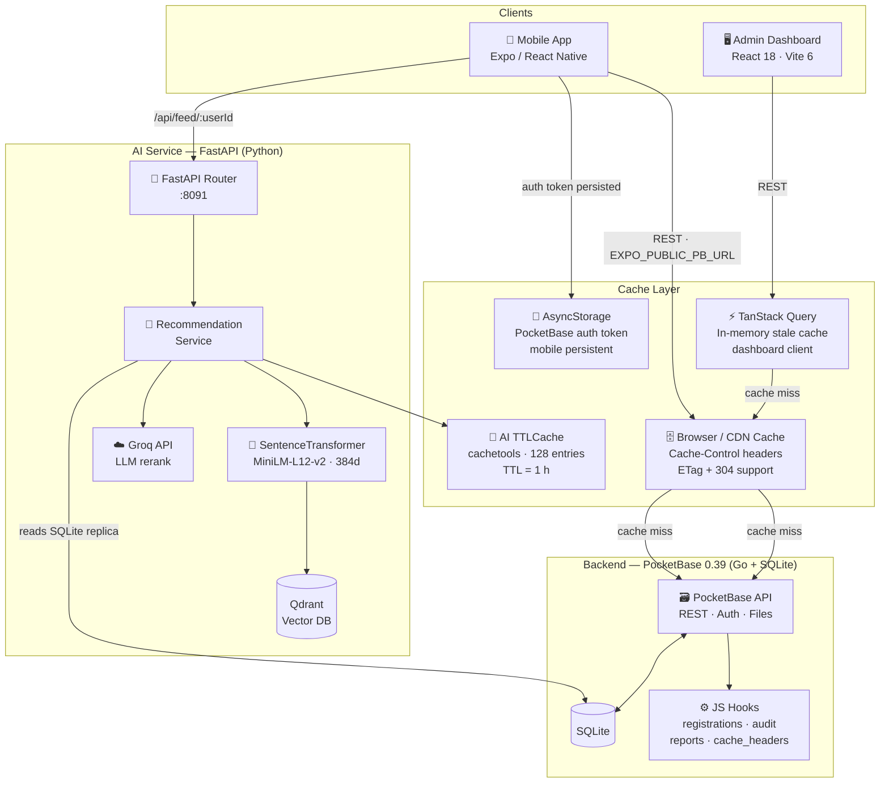
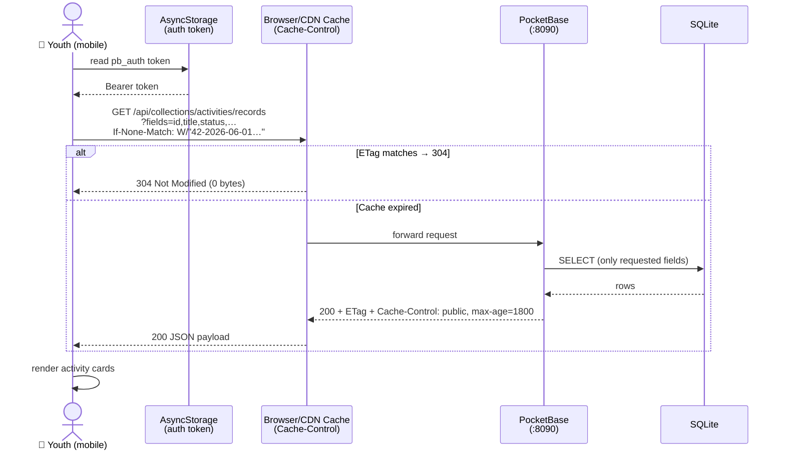
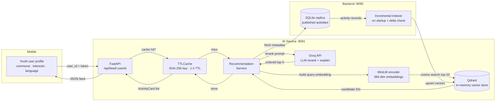
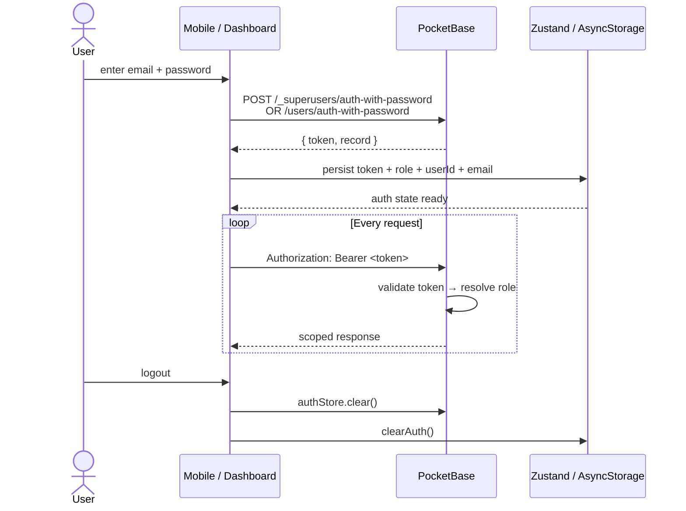
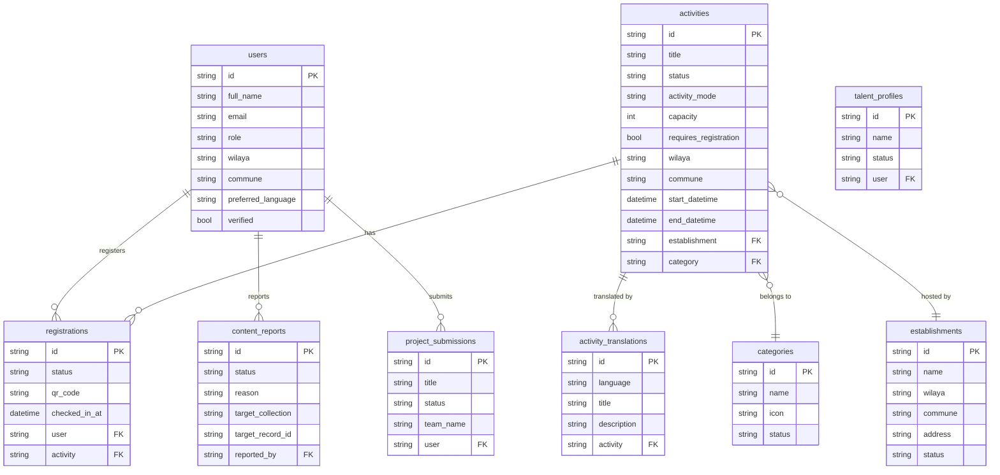

# Chababia — ODEJ Youth Opportunities Platform

> **ECOHACK '26 · "Bridging Youth and Opportunities"**
>
> Centralise and verify every opportunity offered by the **Office des Établissements de Jeunes (ODEJ)** across Algeria — one mobile-friendly access point for youth to discover activities, workshops, and services.

---

## Table of Contents

1. [Vision & Eco Mandate](#vision--eco-mandate)
2. [System Architecture](#system-architecture)
3. [Request & Cache Flow](#request--cache-flow)
4. [Data Flow — AI Recommendations](#data-flow--ai-recommendations)
5. [Authentication Flow](#authentication-flow)
6. [Tech Stack & Eco Rationale](#tech-stack--eco-rationale)
7. [Caching Strategy](#caching-strategy)
8. [Data Model](#data-model)
9. [Role-Based Access Control](#role-based-access-control)
10. [Getting Started](#getting-started)
11. [Environment Variables](#environment-variables)

---

## Vision & Eco Mandate

ECOHACK '26's theme demands measurable eco-efficiency. Every architectural decision in Chababia is evaluated against three green criteria:

| Criterion | How Chababia addresses it |
|---|---|
| **Minimal server compute** | Single-binary PocketBase (Go) — no JVM, no interpreter overhead, no microservice fan-out for core CRUD |
| **Reduced data payloads** | All API calls use PocketBase's `fields=` selector — only the columns the client actually renders are transferred |
| **Battery & data savings** | Aggressive HTTP + in-memory caching with ETag / 304 support — CDN and device cache serve repeat reads with zero server wake-up |

The AI service compounds this: it runs a **384-dimension multilingual MiniLM** model (≈ 120 MB) over a local SQLite read replica — no cloud LLM call for vector search, only for final response generation (Groq).

---

## System Architecture



---

## Request & Cache Flow

The diagram below shows the full lifecycle of a mobile user opening the activity feed — illustrating all three cache layers before a database read is required.



---

## Data Flow — AI Recommendations



---

## Authentication Flow



---

## Tech Stack & Eco Rationale

### Backend — PocketBase 0.39

| Choice | Eco reason |
|---|---|
| **Go single binary** | Compiles to a ~30 MB executable. No JVM warmup, no Node.js event loop. Idle RAM under 30 MB vs. 300+ MB for a typical Node/Spring backend |
| **SQLite (embedded)** | Zero network hop between app and database. No separate DB process. Single-file persistence, trivial backup |
| **JS hooks (Goja runtime)** | Business logic lives inside the binary — no extra process, no HTTP round-trip to a sidecar |
| **`fields=` selector** | Every list endpoint specifies exactly the columns displayed. A 40-column activities record becomes a 7-field JSON object over the wire |
| **ETag + 304** | Repeat reads cost 0 bytes of response body when data has not changed. The ETag is a cheap `count + max(updated)` computation |

### Admin Dashboard — React 18 + Vite 6

| Choice | Eco reason |
|---|---|
| **Vite** | ESM-native dev server, no bundling on save. Production build tree-shakes to the exact component set used |
| **TanStack Query** | Client-side cache with per-collection `staleTime` mirroring server `max-age` — avoids redundant requests within the same session |
| **Recharts (lazy chunk)** | All chart code is in a separate dynamic import chunk, deferred until after the above-the-fold KPI cards render |
| **Shadcn/UI** | Copy-in components — only the primitives actually used are bundled, no full component library shipped to the browser |
| **Tailwind CSS** | PurgeCSS at build time — final CSS is typically < 15 KB for the full dashboard |

### Mobile App — Expo / React Native

| Choice | Eco reason |
|---|---|
| **Expo Router** | File-based routing with automatic code splitting per screen — only the current screen's JS is parsed and executed |
| **Offline-first RSVP** | QR token stored locally; attendance scan works without connectivity, eliminating redundant API calls |
| **PocketBase JS SDK** | `autoCancellation(false)` prevents duplicate in-flight requests; `fields=` used on every query |
| **Reanimated** | GPU-accelerated animations — avoids JS-thread-driven layout thrashing that drains battery |

### AI Service — FastAPI + SentenceTransformers + Qdrant

| Choice | Eco reason |
|---|---|
| **MiniLM-L12-v2 (384d)** | 120 MB model, runs entirely on CPU in < 50 ms. No GPU required, no cloud embedding API call per request |
| **Qdrant in-process** | Vector search inside the same process — zero network latency, no separate container |
| **SQLite read replica** | AI service reads directly from the same SQLite file the backend writes — no ETL pipeline, no data duplication |
| **TTLCache (1 h, 128 entries)** | Repeated feed requests for the same user profile return instantly from memory — Groq API is only called on a genuine cache miss |
| **Groq** | Groq's LPU hardware delivers LLM inference at ~10× lower energy per token than standard GPU inference |
| **Incremental indexer** | Only new/changed activities are re-embedded on each startup — not a full re-index |

---

## Caching Strategy

Chababia has three independent cache layers that stack. A request must miss all three before touching the database.

### Layer 1 — HTTP Cache (browser / CDN)

Set by `pb_hooks/cache_headers.pb.js` on every public collection read.

| Collection(s) | `Cache-Control max-age` | Rationale |
|---|---|---|
| `categories`, `category_translations`, `documents` | **7 days** (604 800 s) | Taxonomy rarely changes |
| `establishments`, `establishment_translations` | **24 hours** (86 400 s) | Location data stable |
| `activities`, `activity_translations` | **30 minutes** (1 800 s) | Content updated frequently but not in real-time |
| `announcements`, `newsletters` | **10 minutes** (600 s) | Time-sensitive content |
| `talent_showcase` | **1 hour** (3 600 s) | Moderate churn |

All responses include a weak **ETag** (`W/"<count>-<max_updated>"`). On re-request the server returns **304 Not Modified** with zero response body when data has not changed.

### Layer 2 — TanStack Query (dashboard client)

`staleTime` values mirror the server `max-age` so the dashboard never refetches data the browser cache would have served anyway.

```
categories / documents   → 7 days
establishments           → 24 hours
activities               → 30 minutes
announcements            → 10 minutes
talentShowcase / users   → 1 hour
projectSubmissions       → 0 (always fresh — competition data)
contentReports           → 0 (always fresh — moderation queue)
registrations            → 0 (always fresh — attendance state)
```

### Layer 3 — AI In-Memory TTLCache

`cache/request_cache.py` wraps every recommendation call in a `cachetools.TTLCache`:
- **Key** — SHA-256 of the JSON-serialised request body (order-insensitive)
- **TTL** — 1 hour
- **Max entries** — 128 (configurable via `CACHE_MAX_SIZE`)

A cache hit costs ≈ 0 ms and 0 Groq API tokens.

---

## Data Model



---

## Role-Based Access Control

| Role | Scope |
|---|---|
| `super_admin` | Full read/write across all collections; user management |
| `wilaya_admin` | Read/write activities and establishments within their wilaya |
| `establishment_manager` | Manage their own establishment and its activities |
| `content_editor` | Create and update activities; cannot publish or delete |
| `attendance_staff` | Check-in registrations (update `status` to `attended`) |
| `youth` | Read published content; create/cancel own registrations |

Access rules are enforced at the PocketBase collection level (migration `1748700014`) and mirrored in the dashboard's `src/lib/permissions.ts` to hide UI affordances the current role cannot use.

---

## Getting Started

### Prerequisites

- Go 1.22+ (for building PocketBase from source) or download the prebuilt binary
- Node.js 20+
- Python 3.11+
- Expo CLI (`npm install -g expo-cli`)

### 1 — Backend

```bash
cd backend
./pocketbase serve
# Admin UI → http://localhost:8090/_/
# REST API → http://localhost:8090/api/
```

Migrations run automatically on first start and populate the schema and seed content.

### 2 — Admin Dashboard

```bash
cd dashboard
npm install
cp .env.example .env          # set VITE_PB_URL=http://localhost:8090
npm run dev
# → http://localhost:5173
```

### 3 — Mobile App

```bash
cd mobile
npm install
# set EXPO_PUBLIC_PB_URL in .env
npx expo start
```

### 4 — AI Recommendation Service

```bash
cd ai/recommendation-system
pip install -r ../requirements.txt

# Download the embedding model once (requires internet)
python -c "from sentence_transformers import SentenceTransformer; SentenceTransformer('paraphrase-multilingual-MiniLM-L12-v2')"

# Set TRANSFORMERS_OFFLINE=1 for subsequent runs (air-gapped / eco)
export GROQ_API_KEY=your_key
uvicorn main:app --reload --port 8091
# Health check → http://localhost:8091/health
```

---

## Environment Variables

### Backend (`backend/.env`)

| Variable | Default | Description |
|---|---|---|
| `SEED_TEST_USERS` | _(unset)_ | Set to `"true"` to seed development accounts (never in production) |

### Dashboard (`dashboard/.env`)

| Variable | Default | Description |
|---|---|---|
| `VITE_PB_URL` | `http://localhost:8090` | PocketBase base URL |

### Mobile (`mobile/.env`)

| Variable | Default | Description |
|---|---|---|
| `EXPO_PUBLIC_PB_URL` | `http://localhost:8090` | PocketBase base URL |

### AI Service (`ai/recommendation-system/.env`)

| Variable | Default | Description |
|---|---|---|
| `GROQ_API_KEY` | _(required)_ | Groq LLM API key |
| `QDRANT_COLLECTION` | `activities` | Qdrant collection name |
| `CACHE_TTL_SECONDS` | `3600` | In-memory cache TTL (seconds) |
| `CACHE_MAX_SIZE` | `128` | Max cached recommendation sets |
| `RECOMMENDATION_TOP_K` | `5` | Activities returned per feed request |

---

## License

See [`backend/LICENSE.md`](backend/LICENSE.md).
