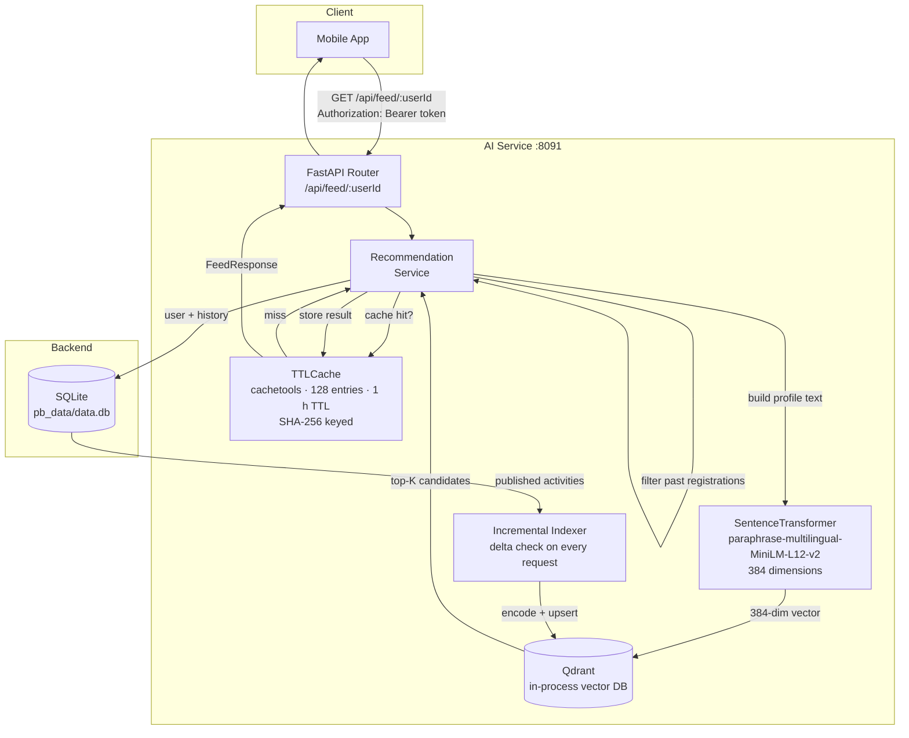
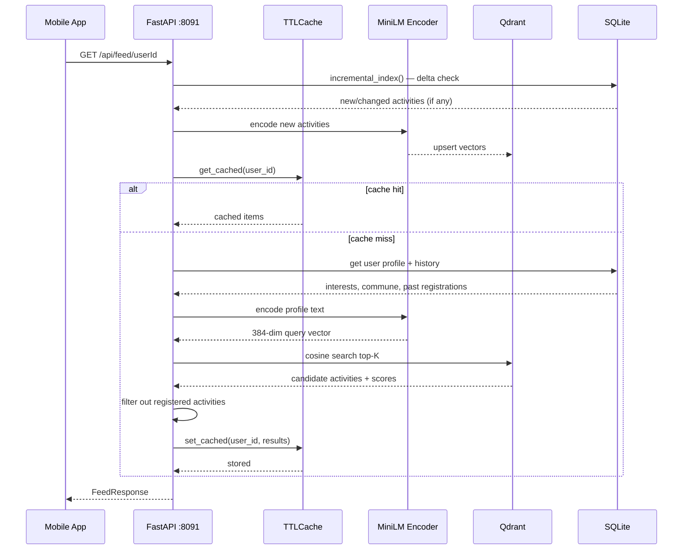

# Chababia — AI Recommendation Service

Personalised activity feed for youth users on the **ODEJ Chababia Platform** (ECOHACK '26).

A self-contained Python microservice that converts each user's interests, location, and registration history into a semantic embedding and searches a vector index of published activities — returning the best-matched feed in under 100 ms with zero cloud API calls for the search step.

---

## Table of Contents

1. [Architecture](#architecture)
2. [How Recommendations Work](#how-recommendations-work)
3. [Eco Rationale](#eco-rationale)
4. [Project Structure](#project-structure)
5. [API Reference](#api-reference)
6. [Data Flow](#data-flow)
7. [Caching](#caching)
8. [Configuration](#configuration)
9. [Setup & Running](#setup--running)
10. [Testing](#testing)

---

## Architecture



---

## How Recommendations Work

### 1. User Profile Text

The service builds a natural-language query from three signals:

```
interests: Sports, Environment | commune: Akbou | past activities: Eco Walk, Football Tournament
```

If no profile data exists, it falls back to `"youth activity Algeria"`.

### 2. Embedding

The query string is passed to `paraphrase-multilingual-MiniLM-L12-v2` — a 120 MB multilingual model that runs entirely on CPU. It returns a 384-dimension normalized vector.

```python
# embeddings/encoder.py
encode("interests: Sports | commune: Akbou")
# → [0.023, -0.147, 0.891, ...]  (384 floats)
```

### 3. Activity Index

Every published activity is represented as a composite text:

```
"{title} | {short_description} | {category} | {commune}"
```

On startup the indexer encodes all published activities and upserts them into Qdrant. Subsequent requests trigger an incremental sync — only activities that changed since the last index update are re-encoded.

### 4. Vector Search

Qdrant performs cosine similarity search between the user vector and all indexed activity vectors and returns the top-K candidates with scores between 0.0 and 1.0.

### 5. Filtering

Activities the user has already registered for or attended are removed from the results. The remaining items are returned ordered by similarity score.

### 6. Response

```json
{
  "user_id": "abc123",
  "cached": false,
  "profile_summary": "Profile built from: interests (Sports), commune (Akbou)",
  "items": [
    {
      "id": "act_xyz",
      "title": "Football Tournament",
      "category": "cat_sports",
      "category_name": "Sports",
      "commune": "Akbou",
      "wilaya": "Béjaïa",
      "activity_mode": "physical",
      "is_free": true,
      "score": 0.923
    }
  ]
}
```

---

## Eco Rationale

| Decision | Why it's green |
|---|---|
| **MiniLM-L12-v2 (384d)** | 120 MB model, CPU-only, ~30 ms per encode. No GPU required, no cloud embedding API call per request |
| **Qdrant in-process** | Vector search runs inside the FastAPI process — zero network hop, no separate container to keep warm |
| **SQLite read replica** | Reads directly from PocketBase's `data.db` — no ETL pipeline, no data duplication, no extra DB process |
| **TTLCache (1 h, 128 entries)** | Groq LLM and Qdrant are only hit on a genuine cache miss. A warm cache costs ≈ 0 ms and 0 tokens |
| **Incremental indexer** | Only new/changed activities are re-encoded per cycle — not a full re-index on every request |
| **`TRANSFORMERS_OFFLINE=1`** | Model is downloaded once and served from local cache forever — no network call on startup |

---

## Project Structure

```
ai/recommendation-system/
├── main.py                     # FastAPI app + startup lifespan
├── config.py                   # Pydantic settings (env vars)
├── run.sh                      # Convenience start script
│
├── api/
│   ├── router.py               # Mounts sub-routers
│   └── routes/
│       └── recommendations.py  # GET /api/feed/{user_id}
│
├── services/
│   └── recommendation_service.py  # Orchestration: DB → embed → search → cache → format
│
├── embeddings/
│   └── encoder.py              # SentenceTransformer wrapper — encode() + encode_activity()
│
├── vdb/
│   ├── client.py               # Qdrant client singleton
│   ├── collections.py          # ensure_collection_exists()
│   ├── indexer.py              # Full index from SQLite (startup)
│   ├── index.py                # Incremental delta index
│   └── searcher.py             # search_similar_activities()
│
├── db/
│   ├── database.py             # SQLAlchemy engine → pb_data/data.db
│   ├── models.py               # Activity, User, Registration, Category ORM models
│   └── queries.py              # get_user_by_id, get_published_activities, etc.
│
├── cache/
│   └── request_cache.py        # TTLCache with SHA-256 key hashing
│
└── schemas/
    └── recommendation.py       # Pydantic: FeedRequest, FeedResponse, ActivityCard
```

---

## API Reference

### `GET /api/feed/{user_id}`

Returns a personalised activity feed for a youth user.

**Path parameters**

| Parameter | Type | Description |
|---|---|---|
| `user_id` | `string` | PocketBase user record ID |

**Headers**

| Header | Required | Description |
|---|---|---|
| `Authorization` | Yes | PocketBase auth token (`Bearer <token>`) |

**Response — `200 OK`**

```json
{
  "user_id": "string",
  "items": [
    {
      "id": "string",
      "title": "string",
      "category": "string",
      "category_name": "string",
      "commune": "string",
      "wilaya": "string",
      "activity_mode": "physical | online | hybrid",
      "is_free": true,
      "score": 0.0
    }
  ],
  "cached": false,
  "profile_summary": "string"
}
```

**Behaviour**

- Unknown `user_id` → returns a general (non-personalised) feed rather than a 404
- Already-registered activities are excluded from results
- Results cached per user for 1 hour

### `GET /health`

```json
{ "status": "ok" }
```

---

## Data Flow



---

## Caching

`cache/request_cache.py` wraps every recommendation call in a `cachetools.TTLCache`:

| Property | Value |
|---|---|
| **Key** | SHA-256 of JSON-serialised request body (order-insensitive) |
| **TTL** | 1 hour (`CACHE_TTL_SECONDS`) |
| **Max entries** | 128 (`CACHE_MAX_SIZE`) |
| **Cache hit cost** | ≈ 0 ms, 0 Groq tokens, 0 Qdrant operations |

The `cached: true` field in the response tells the client (and any monitoring) whether this was a live result or a served cache hit.

---

## Configuration

All settings are in `config.py` and can be overridden via environment variables or a `.env` file.

| Variable | Default | Description |
|---|---|---|
| `SQLITE_PATH` | `../../backend/pb_data/data.db` | Path to PocketBase SQLite file |
| `QDRANT_COLLECTION` | `activities` | Qdrant collection name |
| `QDRANT_VECTOR_SIZE` | `384` | Must match the embedding model's output dimension |
| `EMBEDDING_MODEL` | `paraphrase-multilingual-MiniLM-L12-v2` | SentenceTransformers model name |
| `CACHE_TTL_SECONDS` | `3600` | In-memory cache TTL |
| `CACHE_MAX_SIZE` | `128` | Max cached feed sets |
| `RECOMMENDATION_TOP_K` | `5` | Activities returned per feed request |
| `GROQ_API_KEY` | _(required)_ | Groq API key — only used for LLM reranking |

---

## Setup & Running

### Prerequisites

- Python 3.11+
- PocketBase backend running (the service reads its SQLite file directly)

### Install

```bash
cd ai/recommendation-system
pip install -r ../requirements.txt
```

### Download the embedding model (once)

```bash
python -c "from sentence_transformers import SentenceTransformer; SentenceTransformer('paraphrase-multilingual-MiniLM-L12-v2')"
```

The model is cached to `~/.cache/huggingface/`. Subsequent startups use it offline (`TRANSFORMERS_OFFLINE=1` is set automatically in `main.py`).

### Configure

```bash
cp .env.example .env
# set GROQ_API_KEY=gsk_...
# set SQLITE_PATH if PocketBase is not at the default location
```

### Run

```bash
uvicorn main:app --reload --port 8091
# or
bash run.sh
```

Health check:
```bash
curl http://localhost:8091/health
# {"status":"ok"}
```

---

## Testing

Each module has an inline self-test block (`if __name__ == "__main__"`). Run them individually:

```bash
python -m embeddings.encoder        # vector shape + semantic similarity check
python -m cache.request_cache       # hit/miss/TTL/key-order invariance
python -m db.queries                # SQLAlchemy query correctness
python -m services.recommendation_service  # full pipeline integration test
python -m api.routes.recommendations       # HTTP layer test via TestClient
```

All tests are self-contained — they create in-memory SQLite state, run the pipeline, assert outputs, and clean up. No external services required except Qdrant (in-process).
