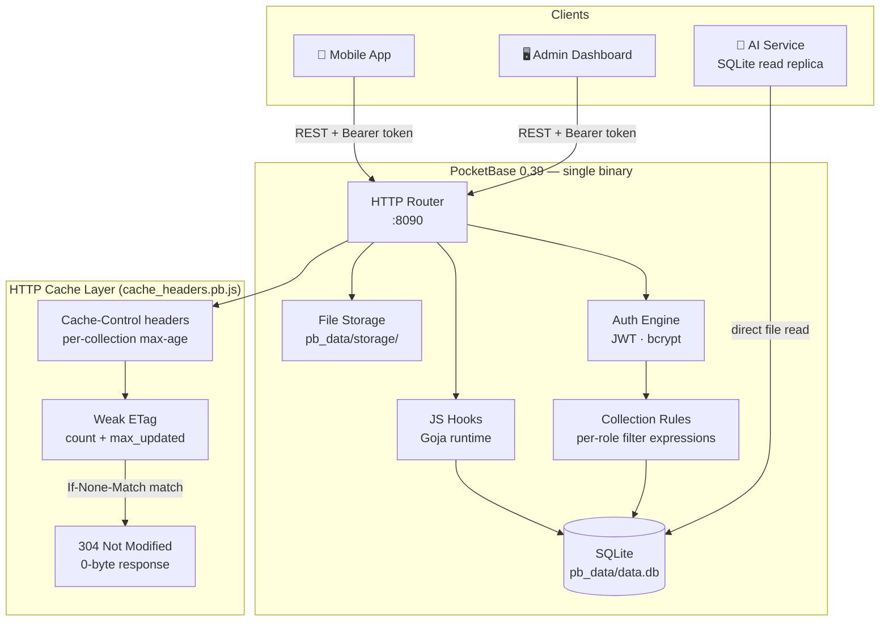
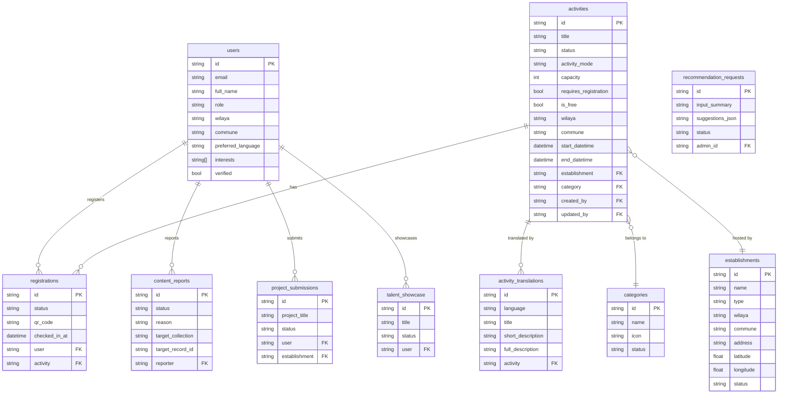
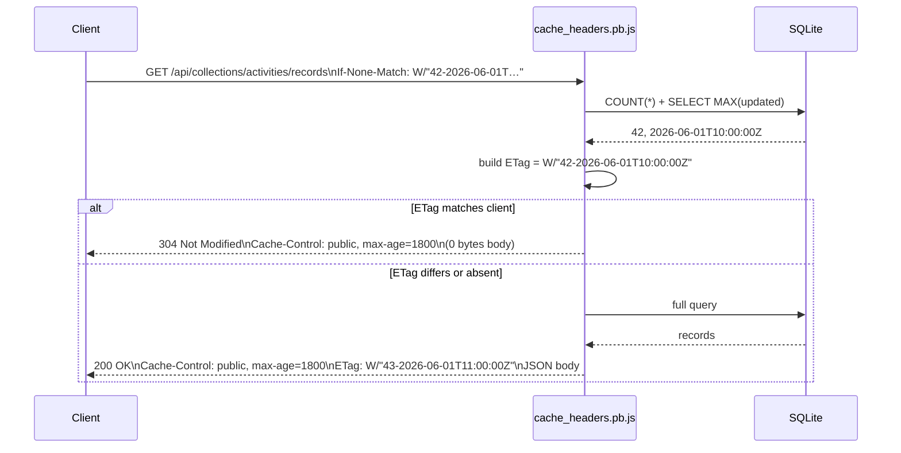
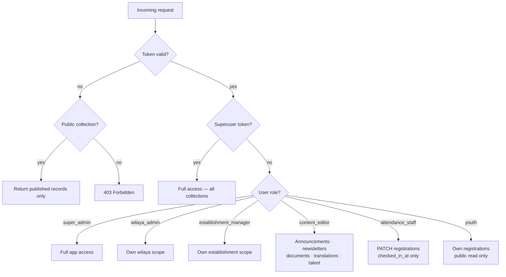
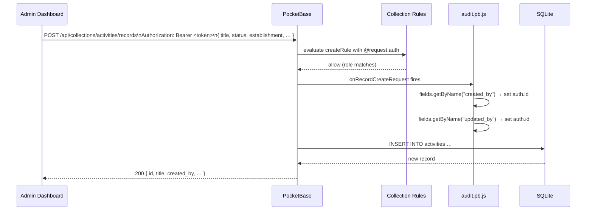

# Chababia — Backend

PocketBase 0.39.0 backend for the **ODEJ Youth Opportunities Platform** (ECOHACK '26).
Single binary + SQLite. No Redis, no microservices, no background jobs — schema, seed,
and all server logic live in git-tracked JS files.

---

## Table of Contents

1. [Architecture](#architecture)
2. [Eco Rationale](#eco-rationale)
3. [Project Structure](#project-structure)
4. [Collections](#collections)
5. [Server Hooks](#server-hooks)
6. [HTTP Cache Layer](#http-cache-layer)
7. [Migration Timeline](#migration-timeline)
8. [Access Control](#access-control)
9. [Request Lifecycle](#request-lifecycle)
10. [API Documentation](#api-documentation)
11. [Seed Data](#seed-data)
12. [Setup & Running](#setup--running)

---

## Architecture



---

## Eco Rationale

Every architectural decision targets the ECOHACK '26 green criteria (30% of score):

| Decision | Impact |
|---|---|
| **Go single binary** | ~30 MB executable, idle RAM < 30 MB. No JVM warmup, no Node.js runtime, no container orchestration |
| **SQLite embedded** | Zero network hop between app and database — one process, one file, one machine |
| **JS hooks (Goja)** | Business logic lives inside the binary — no sidecar, no HTTP round-trip to a serverless function |
| **`fields=` selector** | Every list response carries only the columns the client renders. A 40-field activity record becomes 7 fields over the wire |
| **ETag + 304** | Repeat reads return a 0-byte body when data has not changed — the ETag computation is a single `COUNT + MAX(updated)` SQL query |
| **No realtime subscriptions** | SSE/WebSocket connections are not opened — no persistent keepalive traffic |
| **AI reads SQLite directly** | The AI service reads from `pb_data/data.db` with no ETL pipeline, no data duplication, no extra process |

---

## Project Structure

```
backend/
├── pocketbase              Binary (not committed — download separately)
├── pb_migrations/          JS migrations — applied in filename order on startup
│   ├── 1748700001_init_core_collections.js
│   ├── 1748700002_content_collections.js
│   ├── 1748700003_engagement_collections.js
│   ├── 1748700004_translation_collections.js
│   ├── 1748700009_seed_demo.js
│   ├── 1748700010_fix_recommendation_requests.js
│   ├── 1748700011_add_timestamps.js
│   ├── 1748700012_audit_and_verification.js
│   ├── 1748700013_content_reports.js
│   ├── 1748700014_dashboard_write_rules.js
│   ├── 1748700015_seed_test_users.js
│   ├── 1748700016_seed_full_content.js
│   └── 1748700017_fix_security_rules.js
├── pb_hooks/               JS hooks — server-side logic, hot-reloaded in --dev mode
│   ├── audit.pb.js
│   ├── cache_headers.pb.js
│   ├── recommendations.pb.js
│   ├── registrations.pb.js
│   └── reports.pb.js
├── pb_data/                Runtime data (gitignored — auto-created on first run)
│   ├── data.db             SQLite database
│   └── storage/            Uploaded files (images, PDFs)
└── docs/
    └── openapi.yaml        OpenAPI 3.1 spec
```

---

## Collections



### Collection access summary

| Collection | Public read | Auth read | Write roles |
|---|---|---|---|
| `users` (auth) | — | own record | superuser |
| `categories` | ✅ published | ✅ | superuser |
| `establishments` | ✅ published | ✅ | super_admin, wilaya_admin, establishment_manager |
| `activities` | ✅ published | ✅ | super_admin, wilaya_admin, establishment_manager |
| `registrations` | — | own only | owner (create) · attendance_staff (check-in) |
| `announcements` | ✅ published | ✅ | super_admin, wilaya_admin, content_editor |
| `newsletters` | ✅ published | ✅ | super_admin, wilaya_admin, content_editor |
| `documents` | ✅ published | ✅ | super_admin, wilaya_admin, content_editor |
| `project_submissions` | — | own only | owner |
| `talent_showcase` | ✅ published | ✅ | superuser |
| `content_reports` | — | — | authenticated users (create) · superuser (manage) |
| `recommendation_requests` | — | — | superuser only |
| `activity_translations` | ✅ | ✅ | super_admin, wilaya_admin, content_editor |
| `establishment_translations` | ✅ | ✅ | super_admin, wilaya_admin, content_editor |
| `category_translations` | ✅ | ✅ | superuser |

---

## Server Hooks

```mermaid
flowchart TD
    subgraph "registrations.pb.js — onRecordCreateRequest"
        R1[Lock owner to auth user]
        R2{requires_registration\nAND capacity > 0?}
        R3[COUNT active registrations]
        R4{registered >= capacity?}
        R5[status = waiting_list]
        R6[status = registered]
        R7[Generate 32-char QR token]
        R1 --> R2
        R2 -->|yes| R3
        R3 --> R4
        R4 -->|yes| R5
        R4 -->|no| R6
        R2 -->|no| R6
        R5 --> R7
        R6 --> R7
    end

    subgraph "audit.pb.js — every create + update"
        A1[onCreate: set created_by = auth.id]
        A2[onUpdate: set updated_by = auth.id]
    end

    subgraph "reports.pb.js — onRecordCreateRequest content_reports"
        P1[reporter = auth.id]
        P2[status = new]
    end

    subgraph "recommendations.pb.js — POST /api/admin/event-recommendations"
        C1[Auth guard\nadmin role required]
        C2[Parse commune · wilaya · type]
        C3{Input in cache?}
        C4[Return cached suggestions]
        C5{Rate limit\n≤ 10 per account}
        C6[Call claude-haiku-4-5-20251001]
        C7[Store suggestions_json]
        C8[Return draft suggestions]
        C1 --> C2
        C2 --> C3
        C3 -->|hit| C4
        C3 -->|miss| C5
        C5 -->|ok| C6
        C6 --> C7
        C7 --> C8
    end
```



### Hook summary

| File | Trigger | Responsibility |
|---|---|---|
| `registrations.pb.js` | `onRecordCreateRequest` on `registrations` | Lock owner, enforce capacity server-side, generate 32-char QR token |
| `audit.pb.js` | `onRecordCreateRequest` + `onRecordUpdateRequest` (global) | Stamp `created_by` / `updated_by` on any collection that has those fields, including Admin UI edits |
| `reports.pb.js` | `onRecordCreateRequest` on `content_reports` | Lock `reporter` to auth user, force `status = new` |
| `cache_headers.pb.js` | `routerUse` (every request) | Set `Cache-Control` + weak `ETag`, return `304` on matching `If-None-Match` |
| `recommendations.pb.js` | Custom `routerAdd POST /api/admin/event-recommendations` | Admin AI event-idea helper — input-cached, rate-limited (10/account), draft-only output |

---

## HTTP Cache Layer

`cache_headers.pb.js` intercepts every `GET /api/collections/:name/records` request.



### Cache-Control durations

| Collection(s) | `max-age` | Rationale |
|---|---|---|
| `categories`, `category_translations`, `documents` | **7 days** | Taxonomy rarely changes |
| `establishments`, `establishment_translations` | **24 hours** | Location data stable |
| `activities`, `activity_translations` | **30 minutes** | Content updated frequently; translations aligned to parent TTL |
| `announcements`, `newsletters` | **10 minutes** | Time-sensitive content |
| `talent_showcase` | **1 hour** | Moderate update frequency |
| All other collections | No cache | Auth-gated or real-time data |

---

## Migration Timeline

Migrations run automatically on startup in filename order. All are reversible.

| Migration | What it does |
|---|---|
| `1748700001` | Core collections — `users`, `categories`, `establishments`, `activities`, `registrations` |
| `1748700002` | Content collections — `announcements`, `newsletters`, `documents`, `project_submissions`, `talent_showcase` |
| `1748700003` | Engagement — `recommendation_requests` |
| `1748700004` | Translation collections — `activity_translations`, `establishment_translations`, `category_translations` |
| `1748700009` | Seed real ODEJ Béjaïa demo data (15 categories, 5 establishments, 6 activities + all translations) |
| `1748700010` | Fix `recommendation_requests` field types |
| `1748700011` | Add `updated` autodate field to all collections (required for ETag strategy) |
| `1748700012` | Add `created_by` / `updated_by` audit fields; add verification fields to `users` |
| `1748700013` | Add `content_reports` collection |
| `1748700014` | Dashboard write rules — scoped per role for all collections |
| `1748700015` | Seed test user accounts (env-gated: only runs when `SEED_TEST_USERS=true`) |
| `1748700016` | Seed full content for dashboard display testing |
| `1748700017` | Security rule fixes — registrations updateRule scoped to staff; wilaya_admin list rule scoped to own wilaya |

```bash
./pocketbase migrate up       # apply all pending
./pocketbase migrate down 1   # roll back last
```

---

## Access Control

PocketBase collection rules are filter expressions evaluated per-request. The effective policy:



---

## Request Lifecycle

A full activity creation from the Admin Dashboard:



---

## API Documentation

- **[`docs/openapi.yaml`](docs/openapi.yaml)** — OpenAPI 3.1 spec covering all public and admin endpoints. Import into Swagger UI, Redoc, Postman, or Insomnia for interactive docs.

Key endpoints:

| Method | Path | Auth | Description |
|---|---|---|---|
| `POST` | `/api/collections/users/auth-with-password` | — | Login (youth / staff) |
| `POST` | `/api/collections/_superusers/auth-with-password` | — | Login (superuser) |
| `GET` | `/api/collections/activities/records` | optional | List published activities |
| `GET` | `/api/collections/activities/records/:id` | optional | Get single activity |
| `POST` | `/api/collections/registrations/records` | required | RSVP for an activity |
| `PATCH` | `/api/collections/registrations/records/:id` | required | Update registration (check-in) |
| `POST` | `/api/collections/content_reports/records` | required | Submit a content report |
| `POST` | `/api/admin/event-recommendations` | admin | AI event suggestion endpoint |
| `GET` | `/_/` | superuser | PocketBase Admin UI |

---

## Seed Data

`1748700009_seed_demo.js` seeds real ODEJ Béjaïa data:

- **15 categories** — Sports, Culture, Sciences, Environment, Arts, etc. (+ 45 ar/fr/tzm translations)
- **5 establishments** — MJ Takerietz, MJ Fatima Ramtani, Camp Beni Ksila, CLS Oued Ghir, SP Jebla (+ 15 translations)
- **6 published activities** across them (+ 18 translations)

Test accounts (requires `SEED_TEST_USERS=true`):

| Email | Role | Password |
|---|---|---|
| `superadmin@chababia.dz` | superuser | `Test1234!` |
| `admin@chababia.dz` | super_admin | `Test1234!` |
| `wilaya@chababia.dz` | wilaya_admin | `Test1234!` |
| `manager@chababia.dz` | establishment_manager | `Test1234!` |
| `editor@chababia.dz` | content_editor | `Test1234!` |
| `staff@chababia.dz` | attendance_staff | `Test1234!` |

> **Never** set `SEED_TEST_USERS=true` in production.

---

## Setup & Running

### Requirements

- Linux / macOS
- Download PocketBase 0.39.0 binary from https://pocketbase.io/docs/ and place it in `backend/`

### Run

```bash
cd backend
./pocketbase serve
```

- **REST API** → `http://127.0.0.1:8090/api/`
- **Admin UI** → `http://127.0.0.1:8090/_/`

Migrations and seed run automatically on first start.

### Development (hot-reload + SQL logs)

```bash
./pocketbase serve --dev
```

### First superuser

```bash
./pocketbase superuser upsert admin@chababia.dz <password>
```

### Manual migration control

```bash
./pocketbase migrate up          # apply all pending
./pocketbase migrate down 1      # roll back last migration
```

### Environment variables

| Variable | Default | Description |
|---|---|---|
| `ANTHROPIC_API_KEY` | _(unset)_ | Enables live AI suggestions in `recommendations.pb.js`. Falls back to mock drafts if unset |
| `SEED_TEST_USERS` | _(unset)_ | Set to `"true"` to seed dev accounts via `1748700015` |
