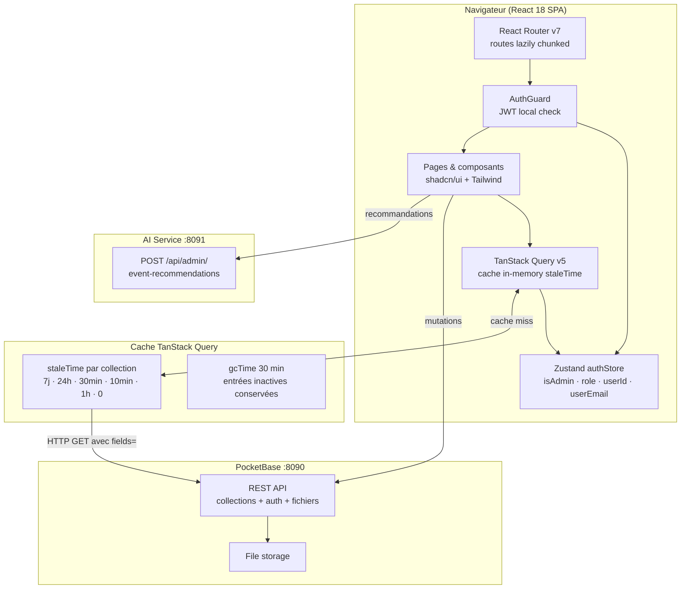
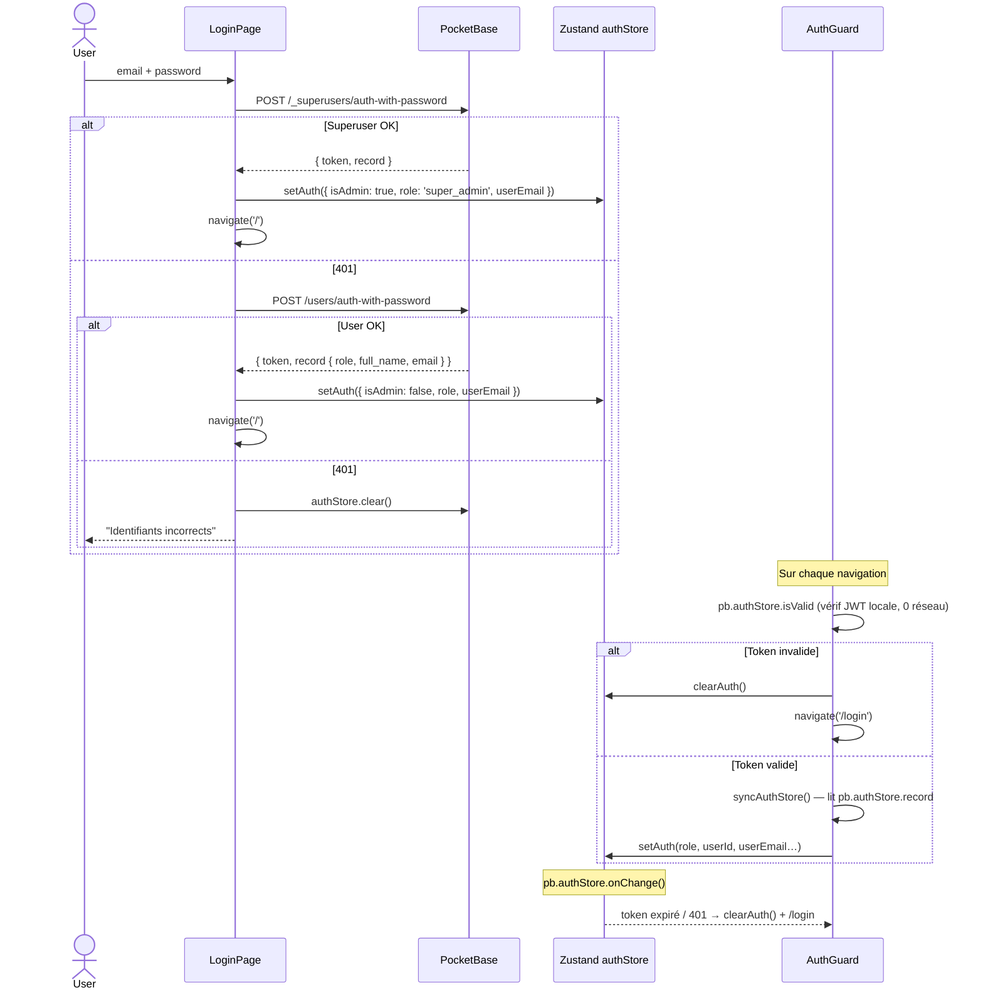
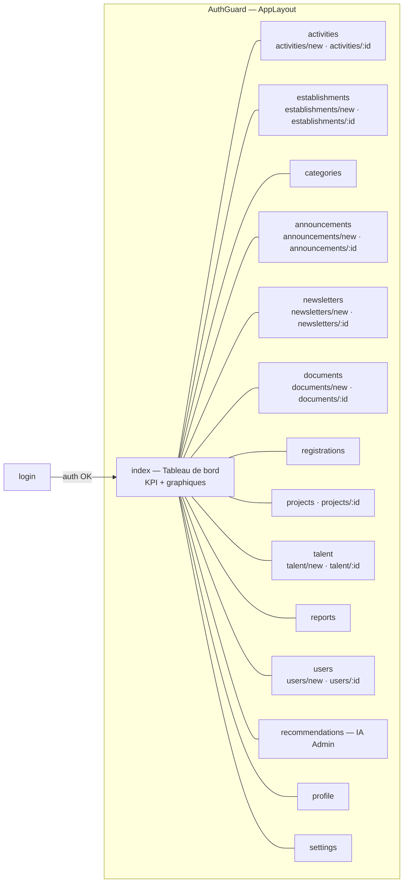
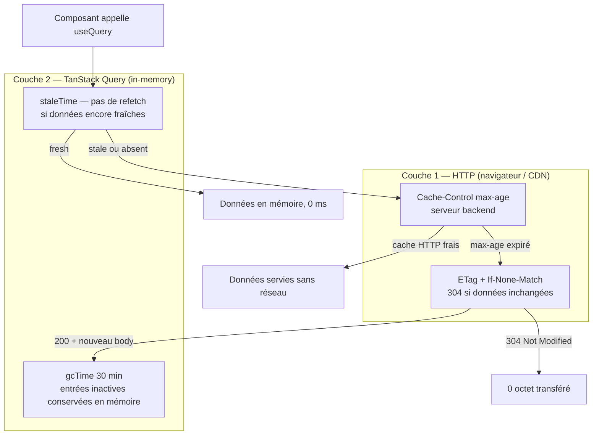

# Chababia — Tableau de bord administrateur

Interface web interne pour la gestion de la plateforme **Chababia / ODEJ YouthConnect**.
Développé dans le cadre d'**ECOHACK '26** — conception Eco-Editorial Brutalism, 0 polling, payloads minces.

---

## Table des matières

1. [Architecture](#architecture)
2. [Mandat écologique](#mandat-écologique)
3. [Stack technique](#stack-technique)
4. [Structure du projet](#structure-du-projet)
5. [Flux d'authentification](#flux-dauthentification)
6. [Pages & routes](#pages--routes)
7. [Système de cache](#système-de-cache)
8. [Permissions & RBAC](#permissions--rbac)
9. [Système de design](#système-de-design)
10. [Composants partagés](#composants-partagés)
11. [Scripts & CI](#scripts--ci)
12. [Installation & démarrage](#installation--démarrage)

---

## Architecture



---

## Mandat écologique

Le dashboard réalise 30 % du score ECOHACK sur le critère d'efficacité écologique :

| Pratique | Implémentation |
|---|---|
| **Payloads minces** | Chaque `getFullList` / `getList` passe `fields=id,col1,col2,…` — seules les colonnes affichées sont transférées |
| **Cache aligné sur le serveur** | Les `staleTime` TanStack Query mirroring exactement les `max-age` du backend — pas de requête inutile dans la session |
| **Pas de polling ni de realtime** | Zéro `setInterval`, zéro WebSocket — les données sont tirées à la demande |
| **Code-splitting par route** | Toutes les pages sont des `lazy()` — le JS d'une page non visitée n'est jamais téléchargé ni parsé |
| **Charts en chunk différé** | `HomeCharts` (Recharts) est un import dynamique séparé — les graphiques ne bloquent pas le rendu des KPI |
| **Thumbnails WebP** | `?thumb=400x0` sur toutes les images — PocketBase génère le WebP à la volée et le met en cache |
| **Pagination systématique** | `perPage ≤ 30` sur tous les appels paginés — jamais de dump complet sur les grandes collections |
| **Zéro erreur lint** | `npm run lint` avec `--max-warnings 0` — aucune impureté silencieuse (promises non gérées, expressions void) |

---

## Stack technique

| Outil | Version | Rôle | Raison écologique |
|---|---|---|---|
| **React** | 18 | Framework UI | Concurrent features — priorité de rendu, pas de re-render inutile |
| **Vite + SWC** | 6 | Bundler + HMR | ESM natif en dev, tree-shaking agressif en prod — CSS + JS final ≤ 200 KB |
| **TypeScript** | strict | Typage statique | Détecte les `fields=` manquants et les types incorrects à la compilation |
| **TanStack Query v5** | 5 | Fetching + cache + mutations | staleTime par collection, gcTime 30 min, retry intelligent |
| **TanStack Table v8** | 8 | Tableaux de données | Virtualisation native — DOM minimal même sur 1000 lignes |
| **Tailwind CSS v3** | 3 | Styles utilitaires | PurgeCSS au build — CSS final < 15 KB |
| **shadcn/ui + Radix UI** | — | Composants accessibles | Copy-in — seuls les primitives utilisées sont bundlées |
| **Zustand** | — | Auth store global | Store minimal (5 champs) — pas de Redux boilerplate |
| **react-router-dom v7** | 7 | Routing SPA | Routes lazy — chunk par page |
| **react-hook-form + zod** | — | Formulaires + validation | Zéro re-render sur frappe, validation typée |
| **Recharts** | 3.8 | Graphiques | Chargé en chunk séparé, lazy |
| **sonner** | — | Toasts | < 3 KB, pas de provider lourd |
| **PocketBase JS SDK** | — | Client API | `autoCancellation(false)` + `fields=` |

---

## Structure du projet

```
dashboard/src/
├── App.tsx                     Router principal + lazy imports
├── main.tsx                    Entry point — QueryClientProvider + ThemeProvider
│
├── components/
│   ├── layout/
│   │   ├── AppLayout.tsx       Shell : Sidebar + Topbar + <Outlet>
│   │   ├── AuthGuard.tsx       Vérification JWT locale + syncAuthStore()
│   │   ├── Sidebar.tsx         Navigation latérale avec badges de rôle
│   │   └── Topbar.tsx          Email · rôle · déconnexion
│   ├── shared/                 Composants réutilisables (voir section dédiée)
│   └── ui/                     Primitives shadcn/ui (Button, Input, Dialog…)
│
├── pages/
│   ├── HomePage.tsx            KPI cards + lazy <HomeCharts>
│   ├── HomeCharts.tsx          Recharts — chunk différé
│   ├── auth/LoginPage.tsx      Double auth : superuser + user
│   ├── activities/             ActivitiesPage · ActivityFormPage
│   ├── establishments/         EstablishmentsPage · EstablishmentFormPage
│   ├── categories/             CategoriesPage
│   ├── announcements/          AnnouncementsPage · AnnouncementFormPage
│   ├── newsletters/            NewslettersPage · NewsletterFormPage
│   ├── documents/              DocumentsPage · DocumentFormPage
│   ├── registrations/          RegistrationsPage
│   ├── projects/               ProjectsPage · ProjectDetailPage
│   ├── talent/                 TalentPage · TalentFormPage
│   ├── reports/                ReportsPage
│   ├── users/                  UsersPage · UserFormPage
│   ├── recommendations/        RecommendationsPage (IA admin)
│   ├── profile/                ProfilePage
│   └── settings/               SettingsPage
│
├── lib/
│   ├── pb.ts                   Instance PocketBase singleton
│   ├── pbData.ts               getList · getFullList · getOne · createRecord · updateRecord · deleteRecord · scrubServerFields · payloadWithFiles
│   ├── permissions.ts          can(action, resource, role, isAdmin) → boolean
│   ├── staleTimes.ts           STALE map — TTL TanStack Query par collection
│   ├── queryClient.ts          QueryClient — retry · gcTime · erreurs globales → pb.authStore.clear()
│   ├── errors.ts               parseClientError · isAuthError
│   ├── theme.ts                Tokens CSS → JS
│   └── utils.ts                cn() + helpers
│
├── stores/
│   └── authStore.ts            Zustand — isAdmin · role · userId · userName · userEmail
│
├── types/
│   └── collections.ts          Types PocketBase — Activity · Establishment · Registration · User…
│
└── styles/
    └── globals.css             Tokens CSS Material You (surface · primary · error…)
```

---

## Flux d'authentification

Le dashboard supporte deux identités : superuser PocketBase et utilisateur `users` avec rôle.



---

## Pages & routes



### Inventaire des pages

| Route | Composant | Rôles autorisés (write) | Description |
|---|---|---|---|
| `/` | `HomePage` | tous | KPI cards + graphiques Recharts lazy |
| `/activities` | `ActivitiesPage` | super_admin, wilaya_admin, establishment_manager | Liste avec filtre + duplication |
| `/activities/new` | `ActivityFormPage` | idem | Formulaire création |
| `/activities/:id` | `ActivityFormPage` | idem | Formulaire édition |
| `/establishments` | `EstablishmentsPage` | super_admin, wilaya_admin, establishment_manager | Liste + carte |
| `/categories` | `CategoriesPage` | superuser | CRUD inline (dialog) |
| `/announcements` | `AnnouncementsPage` | super_admin, wilaya_admin, content_editor | Liste + statut |
| `/registrations` | `RegistrationsPage` | super_admin, wilaya_admin, establishment_manager, attendance_staff | Check-in · export |
| `/projects` | `ProjectsPage` | super_admin, wilaya_admin, establishment_manager | Revue soumissions ECOHACK |
| `/talent` | `TalentPage` | superuser | Gestion talent_showcase |
| `/reports` | `ReportsPage` | superuser | File de modération — résoudre · ignorer · réviser |
| `/users` | `UsersPage` | superuser | Gestion comptes + reset password |
| `/recommendations` | `RecommendationsPage` | admin roles | Génération IA d'idées d'événements |

---

## Système de cache



### Tableau des TTL

| Collection(s) | `staleTime` dashboard | `Cache-Control` backend | Alignement |
|---|---|---|---|
| `categories`, `documents` | **7 jours** | 7 jours | ✅ |
| `establishments`, traductions | **24 heures** | 24 heures | ✅ |
| `activities` | **30 minutes** | 30 minutes | ✅ |
| `announcements`, `newsletters` | **10 minutes** | 10 minutes | ✅ |
| `talent_showcase`, `users`, `recommendationRequests` | **1 heure** | 1 heure | ✅ |
| `registrations`, `contentReports`, `projectSubmissions` | **0** (toujours frais) | non caché | ✅ |

---

## Permissions & RBAC

`src/lib/permissions.ts` expose une seule fonction : `can(action, resource, role, isAdmin)`.
Elle est appelée dans chaque page pour afficher ou masquer les affordances UI — les règles PocketBase restent la barrière de sécurité effective.

```mermaid
flowchart TD
    CAN["can(action, resource, role, isAdmin)"]

    CAN -->|action = read| RD{resource restreint?}
    RD -->|content_reports\nusers\nrecommendation_history| ADM[isAdmin seulement]
    RD -->|autres| AUTH[isAdmin OR role ≠ youth]

    CAN -->|action = write\nou delete| WR{WRITE_RULES[resource]}
    WR -->|activities\nestablishments| SA_WA_EM[super_admin · wilaya_admin\nestab_manager · isAdmin]
    WR -->|announcements\nnewsletters · documents\ntalent_showcase| SA_WA_CE[super_admin · wilaya_admin\ncontent_editor · isAdmin]
    WR -->|categories\ncontent_reports\nusers| ADMIN_ONLY[isAdmin seulement]
    WR -->|registrations| SA_WA_EM_AS[super_admin · wilaya_admin\nestab_manager · attendance_staff · isAdmin]
    WR -->|translations| ANY_NON_YOUTH[tout rôle sauf youth]
    WR -->|recommendations| SA_WA_EM_CE[super_admin · wilaya_admin\nestab_manager · content_editor · isAdmin]
```

---

## Système de design

**Eco-Editorial Brutalism** — minimaliste, fort contraste, zéro décoration superflue.

### Tokens CSS Material You (extrait `globals.css`)

| Token | Valeur | Usage |
|---|---|---|
| `--primary` | `#9fe870` | Vert citron ODEJ — accent principal |
| `--on-primary` | `#163300` | Texte sur fond primaire |
| `--surface` | `#ffffff` | Fond page |
| `--surface-container` | `#f1f4ee` | Fond cartes bento |
| `--on-surface` | `#0e0f0c` | Texte principal |
| `--on-surface-variant` | `#454745` | Texte secondaire |
| `--error` | `#d03238` | Statuts d'erreur / danger |
| `--outline-variant` | `#c3c8bd` | Bordures subtiles |

### Conventions visuelles

- **Grille bento** — cartes avec `.bento-card` : `rounded-2xl`, `bg-surface-container`, `border border-outline-variant`
- **Police** — Outfit (variable), chargée via Google Fonts
- **Coins** — `rounded-xl` (16 px) pour cartes, `rounded-lg` (8 px) pour boutons et inputs
- **Élévation tonale** — pas de `box-shadow`, séparation par variation de teinte de surface
- **Typographie** — échelle Material You : `text-display-lg`, `text-headline-sm`, `text-label-sm`…

---

## Composants partagés

`src/components/shared/` — utilisés sur toutes les pages :

| Composant | Description |
|---|---|
| `DataTable` | TanStack Table + pagination + tri + search |
| `PageHeader` | Titre · description · slot action (bouton) |
| `StatusBadge` | Badge coloré selon statut (published · draft · cancelled…) |
| `FormField` | Wrapper label + error + hint pour react-hook-form |
| `LoadingSkeletons` | `TableSkeleton` · `KpiSkeleton` · `ChartSkeleton` · `PageSkeleton` |
| `ErrorState` | Affichage d'erreur avec bouton retry |
| `EmptyState` | Illustration + message quand liste vide |
| `ConfirmDialog` | Dialog de confirmation destructive |
| `FileUpload` | Upload image avec compression WebP client-side |
| `ImageThumb` | Aperçu image depuis URL PocketBase (`?thumb=400x0`) |
| `LanguageTabs` | Tabs fr / ar / tzm pour formulaires de traduction |
| `EstablishmentsMap` | Carte Leaflet lazy des établissements |
| `ChababiaLogo` | SVG logo vectoriel |

---

## Scripts & CI

```bash
npm run dev          # Vite HMR — http://localhost:5173
npm run build        # Build de production (tree-shaking, minification)
npm run preview      # Prévisualisation du build
npm run typecheck    # tsc --noEmit — 0 erreur exigé
npm run lint         # ESLint --max-warnings 0 — 0 avertissement toléré
```

La CI (ou vérification locale pré-commit) doit passer `typecheck` et `lint` avant tout push.

---

## Installation & démarrage

### Prérequis

- Node.js ≥ 18
- Backend PocketBase en cours d'exécution (`../backend/`)

### Installer

```bash
cd dashboard
npm install
```

### Configurer

```bash
cp .env.example .env
# VITE_PB_URL=http://localhost:8090  (défaut)
```

### Démarrer

```bash
# Terminal 1 — backend
cd ../backend && ./pocketbase serve --dev

# Terminal 2 — dashboard
npm run dev
# → http://localhost:5173
```

> Ajouter `http://localhost:5173` aux origines CORS autorisées dans PocketBase Admin UI → **Settings → Application**.

### Build de production

```bash
npm run build
# dist/ prêt à déployer sur Nginx / Caddy / S3+CloudFront
```
