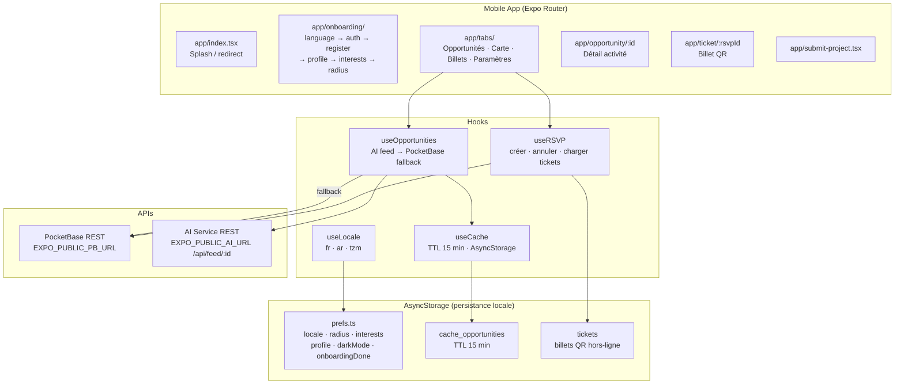
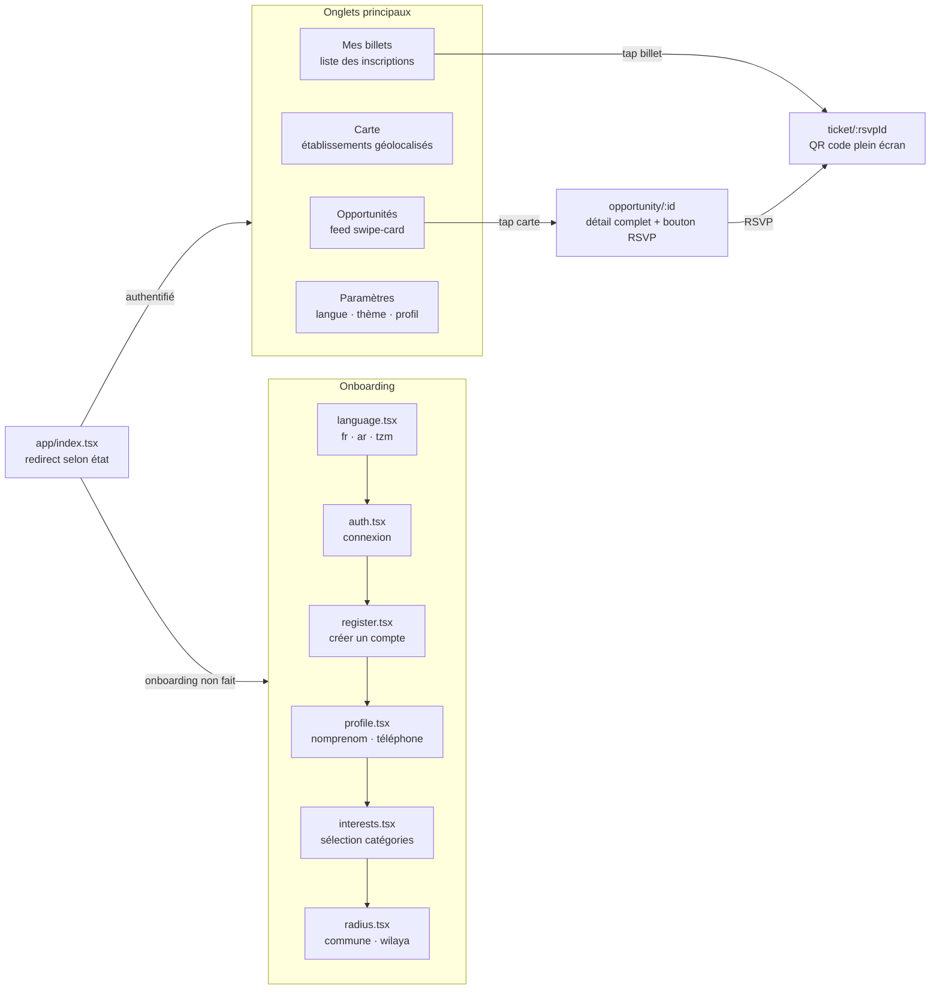
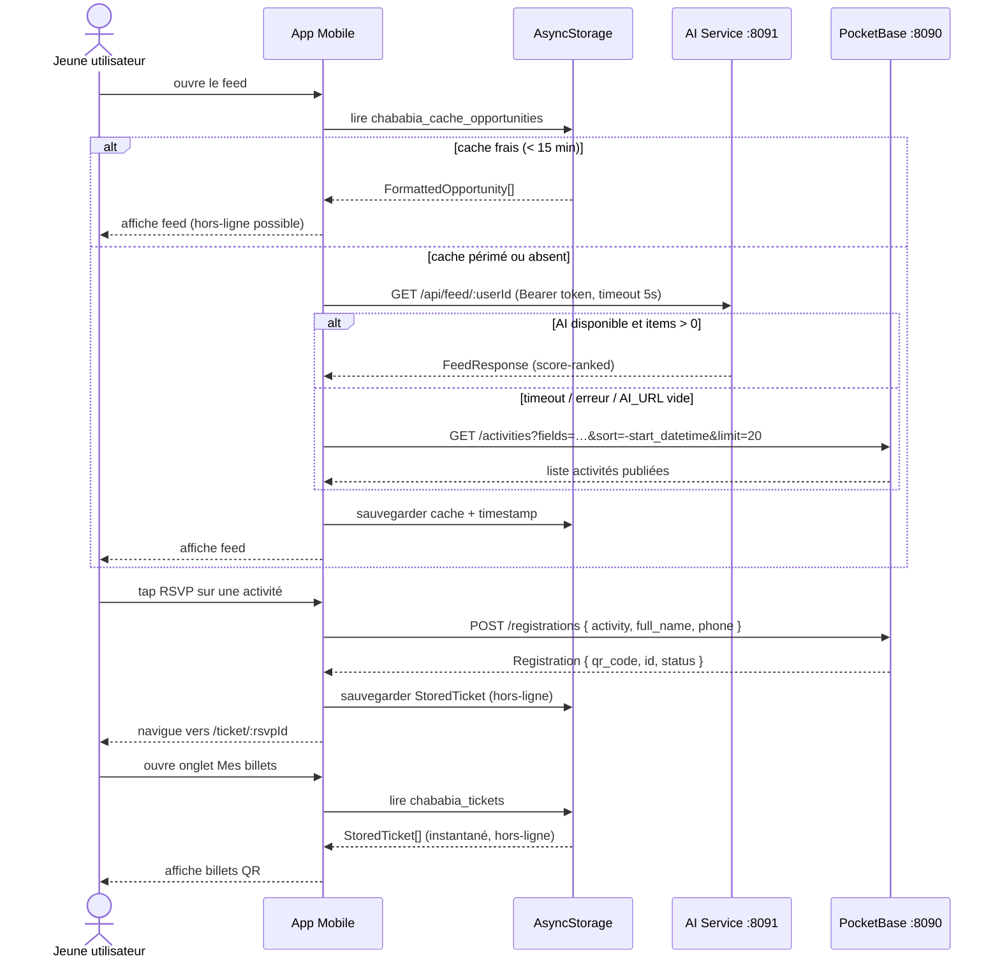

# Chababia — Application Mobile

Application mobile cross-platform pour les jeunes algériens, développée dans le cadre d'**ECOHACK '26**.
Point d'accès unique aux opportunités proposées par l'Office des Établissements de Jeunes (ODEJ) :
activités, ateliers, services, événements.

---

## Table des matières

1. [Architecture](#architecture)
2. [Mandat écologique](#mandat-écologique)
3. [Écrans & navigation](#écrans--navigation)
4. [Stack technique](#stack-technique)
5. [Système de design](#système-de-design)
6. [Internationalisation](#internationalisation)
7. [Hooks & logique métier](#hooks--logique-métier)
8. [Flux de données](#flux-de-données)
9. [Stockage local](#stockage-local)
10. [Configuration](#configuration)
11. [Installation & démarrage](#installation--démarrage)

---

## Architecture



---

## Mandat écologique

Toutes les décisions d'architecture sont évaluées selon trois critères ECOHACK :

| Critère | Implémentation |
|---|---|
| **Payloads minces** | `fields=` sur chaque appel PocketBase — seuls les champs rendus à l'écran sont transférés |
| **Économie batterie** | Reanimated pour les animations GPU-native (pas de layout JS-thread) ; Expo Router avec code-splitting par écran |
| **Hors-ligne first** | Billets QR stockés dans AsyncStorage — scan de présence sans connectivité ; feed mis en cache 15 min |
| **Pas de polling** | Pas de `setInterval`, pas de realtime WebSocket — données tirées à la demande |
| **Fallback gracieux** | Si l'IA ne répond pas (timeout 5 s), PocketBase prend le relais sans erreur visible |

---

## Écrans & navigation



### Détail des écrans

| Écran | Fichier | Description |
|---|---|---|
| Splash / Redirect | `app/index.tsx` | Vérifie `onboardingDone` et l'auth ; redirige vers onboarding ou tabs |
| Langue | `app/onboarding/language.tsx` | Sélection fr/ar/tzm — persiste dans AsyncStorage |
| Connexion | `app/onboarding/auth.tsx` | Login PocketBase + token persisté |
| Inscription | `app/onboarding/register.tsx` | Création de compte `users` |
| Profil | `app/onboarding/profile.tsx` | Prénom, nom, téléphone |
| Intérêts | `app/onboarding/interests.tsx` | Multi-sélect catégories |
| Rayon | `app/onboarding/radius.tsx` | Commune / wilaya préférée |
| Feed | `app/(tabs)/index.tsx` | Swipe-cards d'activités, filtre par catégorie |
| Carte | `app/(tabs)/map.tsx` | Établissements ODEJ sur carte |
| Mes billets | `app/(tabs)/tickets.tsx` | Liste des inscriptions actives et passées |
| Paramètres | `app/(tabs)/settings.tsx` | Langue, thème, déconnexion |
| Détail activité | `app/opportunity/[id].tsx` | Infos complètes + bouton RSVP |
| Billet QR | `app/ticket/[rsvpId].tsx` | QR code du token (scan par le staff) |
| Soumettre projet | `app/submit-project.tsx` | Formulaire ECOHACK project_submissions |
| Annonces | `app/announcements.tsx` | Liste annonces / newsletters |
| Établissements | `app/establishments.tsx` | Annuaire établissements ODEJ |

---

## Stack technique

| Outil | Rôle | Raison écologique |
|---|---|---|
| **React Native + Expo** | Framework cross-platform | Un seul code, deux plateformes — pas deux bases de code à maintenir |
| **Expo Router** | Navigation fichier-based | Code-splitting automatique par écran — le JS d'un écran non visité n'est pas parsé |
| **TanStack Query** | Fetching + cache | `staleTime: 30 min` global — évite les requêtes redondantes dans la même session |
| **Reanimated** | Animations | GPU-native — pas de saut sur le JS thread, 0 drain batterie supplémentaire |
| **AsyncStorage** | Persistance locale | Léger, natif, sans dépendance SQLite supplémentaire |
| **Lucide React Native** | Icônes | Icônes SVG à la demande — pas de sprite sheet |
| **PocketBase JS SDK** | Client API | `autoCancellation(false)` + `fields=` — zéro requête doublée, payload minimal |

---

## Système de design

Défini dans `src/design-system/` — tokens partagés utilisés sur tous les écrans.

### Couleurs

```ts
primary:       '#9fe870'   // vert citron ODEJ
primaryActive: '#cdffad'
primaryPale:   '#e2f6d5'
ink:           '#0e0f0c'   // texte principal
body:          '#454745'
mute:          '#868685'
canvas:        '#ffffff'
canvasSoft:    '#e8ebe6'
positive:      '#2ead4b'
negative:      '#d03238'
warning:       '#ffd11a'
```

### Typographie

Police **Outfit** (variable), chargée via `expo-font`. Échelle définie dans `src/design-system/typography.ts`.

### Espacements & coins

- Espacement : grille 4 px (`src/design-system/spacing.ts`)
- Coins : `rounded-xl` 16 px / 24 px selon le composant (`src/design-system/rounded.ts`)

### Thème

`ThemeContext` fournit un thème clair/sombre dynamique. `LocaleContext` propage la locale active à tous les composants.

### Composants partagés

| Composant | Fichier | Usage |
|---|---|---|
| `OpportunityCard` | `src/components/OpportunityCard.tsx` | Carte swipeable du feed |
| `OpportunityItem` | `src/components/OpportunityItem.tsx` | Vue liste compacte |
| `TicketCard` | `src/components/TicketCard.tsx` | Billet dans l'onglet Mes billets |
| `QrCode` | `src/components/QrCode.tsx` | QR code plein écran (billet) |
| `Badge` | `src/components/Badge.tsx` | Étiquette statut / catégorie |
| `Chip` | `src/components/Chip.tsx` | Filtre sélectionnable |
| `Card` | `src/components/Card.tsx` | Conteneur bento générique |
| `Button` | `src/components/Button.tsx` | Bouton primaire / secondaire |
| `TextInput` | `src/components/TextInput.tsx` | Champ de saisie stylisé |
| `MapPreview` | `src/components/MapPreview.tsx` | Aperçu carte intégré |
| `OnboardingFrame` | `src/components/OnboardingFrame.tsx` | Conteneur d'écran onboarding |
| `Tag` | `src/components/Tag.tsx` | Micro-étiquette de catégorie |

---

## Internationalisation

Trois langues — Français (défaut), Arabe, Tamazight (tifinagh).

```
src/i18n/
  fr.json      # clés de référence
  ar.json      # traductions arabes
  tzm.json     # traductions tamazight (tifinagh)
  index.ts     # t(locale, 'section.clé') + getTranslations()
```

La locale est persistée dans AsyncStorage (`chababia_locale`) et exposée via `useLocale()`.

```ts
import { useLocale } from '@/src/hooks/useLocale'
const { locale, setLocale } = useLocale()
```

Le RTL est activé automatiquement quand `locale === 'ar'`.

---

## Hooks & logique métier

### `useOpportunities`

Stratégie AI-first avec fallback PocketBase :

```
1. Appel AI service GET /api/feed/:userId (timeout 5 s)
   → Si réussi et items > 0 : cache + retourne
2. Sinon : getList PocketBase (20 activités publiées, tri -start_datetime)
   → cache + retourne
```

Expose : `opportunities`, `filterByCategory(cat)`, `loading`, `error`, `stale`, `fetchOpportunities`.

### `useRSVP`

| Méthode | Description |
|---|---|
| `rsvp(activityId, title)` | `POST /registrations` → reçoit `qr_code` 32 chars → sauvegarde `StoredTicket` en local |
| `cancelRsvp(registrationId)` | `PATCH /registrations/{id}` status → cancelled → met à jour AsyncStorage |
| `loadTickets()` | Lit les `StoredTicket[]` depuis AsyncStorage (hors-ligne) |
| `loadRegistrations()` | `getFullList /registrations?expand=activity` (en ligne) |

### `useCache`

Cache générique TTL sur AsyncStorage. Fournit `data`, `stale`, `loadFromCache()`, `saveToCache()`.
Utilisé par `useOpportunities` avec un TTL de 15 minutes.

### `useLocale`

Wrapper sur `LocaleContext`. Retourne `{ locale, setLocale, loaded }`.

---

## Flux de données



---

## Stockage local

Toutes les préférences et caches utilisent `src/storage/prefs.ts` — une fine surcouche AsyncStorage avec sérialisation JSON et échec silencieux.

| Clé | Type | Description |
|---|---|---|
| `chababia_locale` | `'fr' \| 'ar' \| 'tzm'` | Langue choisie |
| `chababia_radius` | `number` | Rayon géographique (km) |
| `chababia_interests` | `string[]` | Catégories sélectionnées à l'onboarding |
| `chababia_profile` | `object` | Données profil utilisateur |
| `chababia_dark_mode` | `boolean` | Thème sombre actif |
| `chababia_likes` | `string[]` | IDs d'activités aimées |
| `chababia_onboarding_done` | `boolean` | Onboarding complété |
| `chababia_cache_opportunities` | `CacheEntry<FormattedOpportunity[]>` | Feed mis en cache (TTL 15 min) |
| `chababia_tickets` | `StoredTicket[]` | Billets QR (hors-ligne) |
| `chababia_cache_geo` | `object` | Cache géolocalisation |

---

## Configuration

| Variable | Défaut | Description |
|---|---|---|
| `EXPO_PUBLIC_PB_URL` | `http://localhost:8090` | URL du backend PocketBase |
| `EXPO_PUBLIC_AI_URL` | _(vide)_ | URL du service AI (`:8091`). Si vide, l'IA est désactivée et le fallback PocketBase est utilisé |

---

## Installation & démarrage

### Prérequis

- Node.js 20+
- Expo CLI : `npm install -g expo-cli`
- Backend PocketBase en cours d'exécution (voir `../backend/`)

### Installer

```bash
cd mobile
npm install
```

### Configurer

```bash
cp .env.example .env
# EXPO_PUBLIC_PB_URL=http://localhost:8090
# EXPO_PUBLIC_AI_URL=http://localhost:8091   # optionnel
```

### Démarrer

```bash
npx expo start
```

Scanner le QR code avec l'app **Expo Go** (iOS / Android), ou appuyer sur `i` (simulateur iOS) / `a` (émulateur Android).

### Build de production

```bash
npx expo build:android   # APK / AAB
npx expo build:ios       # IPA
```
