# ODEJ Youth Opportunities Platform — Specification Document

## 1. Project Overview

### 1.1 Project Name

Working name: **Chabab Connect**

The final name can be changed later.

### 1.2 Context

This project is designed for **ECOHACK '26**, organized by **Club Origo**, under the theme:

> Bridging Youth and Opportunities

The challenge is to create a technology solution that helps young people connect with the programs, activities, services, spaces, and opportunities offered by **ODEJ** and youth establishments across Algeria.

The solution must follow the ECOHACK Green Tech mandate:

- Minimalist architecture
- Low server compute
- Reduced data payloads
- Efficient caching
- Lightweight mobile interface
- Low battery consumption
- No unnecessary AI
- No unnecessary microservices
- No hallucinated information
- Easy content updates by ODEJ staff without code

---

## 2. Problem Statement

ODEJ and youth establishments provide many opportunities for young people, such as:

- Activities
- Workshops
- Sports events
- Cultural programs
- Awareness campaigns
- Volunteering opportunities
- Youth orientation
- Training sessions
- Scientific and artistic activities
- Youth hostels and camps
- Support and listening services

However, information is often fragmented across:

- Official websites
- Facebook pages
- PDFs
- Local announcements
- Physical posters
- Word of mouth

This makes it difficult for young people to discover opportunities near them, register easily, and stay informed.

The problem is not the absence of opportunities.  
The problem is the lack of a simple, verified, centralized, mobile-friendly access point.

---

## 3. Proposed Solution

The proposed solution is a **lightweight multilingual mobile platform** that centralizes verified ODEJ opportunities and makes them accessible to young people.

The platform has two main parts:

1. **Youth Mobile App**
   - Discover activities
   - Search by commune, category, date, and interests
   - View ODEJ establishments
   - Register for activities
   - Receive restrained notifications
   - Receive admin-published newsletters and important updates
   - Access orientation and support information
   - Submit youth project ideas
   - View selected youth achievements

2. **ODEJ Admin Dashboard**
   - Add and update activities
   - Manage establishments
   - Publish announcements
   - Publish newsletters
   - Manage registrations
   - Scan attendance QR codes
   - Manage multilingual content
   - Review youth project submissions
   - Publish talent showcase items
   - Request lightweight event recommendation ideas for admins
   - View simple aggregate statistics

The platform is not a social network and not an AI-first product.  
It is a factual, verified, low-bandwidth opportunity access system.

---

## 4. Target Users

### 4.1 Youth Users

Young people who want to:

- Discover activities near them
- Join clubs, workshops, and events
- Register for programs
- Find youth establishments
- Access support and orientation services
- Participate in volunteering actions
- Submit project ideas
- View local youth achievements

### 4.2 ODEJ Staff

Administrative users who need to:

- Publish activities
- Update establishment information
- Manage registrations
- Verify information
- Publish announcements
- Manage documents
- Review youth project submissions
- Track attendance
- Update multilingual content without code

### 4.3 Establishment Managers

Managers of youth houses, youth hostels, sports complexes, camps, polyvalent halls, and scientific leisure centers who need to update local activities and services.

---

## 5. Core Objectives

The platform must:

1. Increase youth awareness of ODEJ opportunities.
2. Facilitate access to youth establishments and services.
3. Encourage participation, volunteering, and community engagement.
4. Improve communication between youth and ODEJ structures.
5. Support Arabic, French, and Tamazight.
6. Provide factual and verified information.
7. Allow staff to update content without writing code.
8. Minimize data usage, battery usage, and server compute.
9. Avoid unnecessary AI and overengineering.
10. Work well on older devices and weak networks.

---

# 6. Final Technology Stack

## 6.1 Mobile App

The mobile app will use:

```txt
React Native + Expo + TypeScript
```

Recommended libraries:

```txt
Expo Router
TanStack Query / React Query
AsyncStorage
Expo SQLite, optional
i18n library
Expo Notifications, optional

```

### Why React Native + Expo?

React Native is suitable because:

* It gives a real mobile app experience.
* It supports Android and iOS from one codebase.
* It is friendly for youth-facing mobile apps.
* It has a large ecosystem.
* It can be optimized for low data usage and battery efficiency.

Expo is suitable because:

* It reduces setup complexity.
* It speeds up hackathon development.
* It simplifies testing and deployment.
* It avoids unnecessary native configuration during the MVP phase.

---

## 6.2 Backend

The backend will use:

```txt
PocketBase
```

PocketBase provides:

* REST API
* SQLite database
* Authentication
* File storage
* Admin dashboard
* Access rules
* Basic realtime support if needed
* Single-binary deployment

### Why PocketBase?

PocketBase is the best backend choice for this project because:

* It is lightweight.
* It uses SQLite.
* It runs as a single service.
* It has a built-in admin dashboard.
* It allows ODEJ staff to manage content without code.
* It reduces development time.
* It avoids unnecessary infrastructure.
* It fits ECOHACK’s maintainability and eco-efficiency requirements.

---

## 6.3 Database

The database will use:

```txt
SQLite
```

SQLite is enough for the MVP because the system mostly stores:

* Users
* Establishments
* Activities
* Registrations
* Categories
* Announcements
* Newsletters
* Documents
* Translations
* Project submissions
* Talent showcase items
* Recommendation requests

If the platform grows nationally later, the system can migrate to PostgreSQL.

---

## 6.4 Hosting

Recommended deployment:

```txt
Small VPS
Caddy or Nginx reverse proxy
HTTPS
PocketBase service
SQLite database file
Scheduled backups
```

Avoid in MVP:

```txt
Redis
Kubernetes
Microservices
MongoDB cluster
Separate AI service
Heavy analytics pipeline
Video hosting
Realtime social feed
```

---

# 7. Final High-Level System Design

```mermaid
flowchart TD
    Youth[Youth Users<br/>Mobile App] 
    Staff[ODEJ Staff<br/>Admin Dashboard]

    subgraph MobileApp[React Native + Expo Mobile App]
        Home[Home / Activity Discovery]
        Directory[Establishment Directory]
        Register[Activity Registration]
        QR[Personal QR Code]
        Projects[Youth Project Submission]
        Talent[Talent Showcase]
        Support[Orientation / Listening Support]
        NewsletterInbox[Newsletter Inbox]
        LowBandwidth[Low-Bandwidth Mode]

        Cache1[React Query Memory Cache]
        Cache2[AsyncStorage / Expo SQLite<br/>Persistent Local Cache]
        ImageCache[Device Image Cache<br/>Compressed WebP Thumbnails]
    end

    subgraph AdminDashboard[PocketBase Admin Dashboard]
        ManageActivities[Manage Activities]
        ManageEstablishments[Manage Establishments]
        ManageRegistrations[Manage Registrations]
        Attendance[QR Attendance Check-in]
        ManageProjects[Review Project Submissions]
        ManageTalent[Publish Talent Showcase]
        ManageDocs[Manage Documents]
        ManageNewsletters[Publish Newsletters]
        Analytics[Simple Aggregate Analytics]
        Translation[Optional AI Translation / Simplification]
        Recommendations[Optional Event Recommendations]
    end

    subgraph Backend[PocketBase Backend]
        API[REST API]
        Auth[Authentication + Access Rules]
        HTTP[HTTP Cache Headers<br/>Cache-Control + ETag]
        Validation[Validation + Publishing Rules]
        Files[Compressed File Storage<br/>Images + Documents]
    end

    subgraph Database[SQLite Database]
        Users[(Users)]
        Establishments[(Establishments)]
        Activities[(Activities)]
        Registrations[(Registrations)]
        Categories[(Categories)]
        Announcements[(Announcements)]
        Newsletters[(Newsletters)]
        Documents[(Documents)]
        Translations[(Translations)]
        ProjectSubmissions[(Project Submissions)]
        TalentShowcase[(Talent Showcase)]
        RecommendationRequests[(Recommendation Requests)]
    end

    AI[Optional AI Provider<br/>Manual Admin Use Only]
    Push[Optional Push Notifications<br/>Digest + Reminders + Newsletters Only]

    Youth --> MobileApp
    Staff --> AdminDashboard

    MobileApp -->|HTTPS REST API| API
    AdminDashboard -->|HTTPS| API

    API --> Auth
    API --> HTTP
    API --> Validation
    API --> Files

    API --> Users
    API --> Establishments
    API --> Activities
    API --> Registrations
    API --> Categories
    API --> Announcements
    API --> Newsletters
    API --> Documents
    API --> Translations
    API --> ProjectSubmissions
    API --> TalentShowcase
    API --> RecommendationRequests

    MobileApp --> Cache1
    Cache1 --> Cache2
    MobileApp --> ImageCache

    Files --> ImageCache

    Translation -.->|Manual request only| AI
    AI -.->|Draft suggestion only| Translation
    Recommendations -.->|Manual request only| AI
    AI -.->|Draft suggestions only| Recommendations

    Push -.->|Weekly digest / reminders / newsletters| MobileApp

    Eco[Eco-Friendly Rules<br/>No Redis in MVP<br/>No microservices<br/>No video hosting<br/>No continuous GPS<br/>No always-on AI<br/>Small payloads + pagination<br/>Cached public data]

    Backend --> Eco
    MobileApp --> Eco
```

---

# 8. Deployment Design

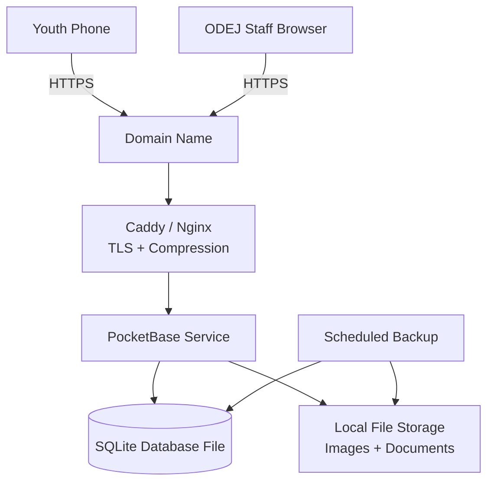

The deployment is intentionally simple:

* One VPS
* One PocketBase service
* One SQLite database
* One file storage directory
* HTTPS through Caddy or Nginx
* Scheduled backups

This reduces infrastructure, cost, maintenance, and carbon footprint.

---

# 9. Main Functional Modules

The platform includes the following modules:

```txt
1. Youth Mobile App
2. ODEJ Admin Dashboard
3. Establishment Directory
4. Activity Discovery
5. Activity Registration
6. QR Attendance
7. Hybrid Activities
8. Low-Bandwidth Mode
9. Notifications
10. Youth Project Incubation
11. Lightweight Talent Showcase
12. Youth Orientation Hub
13. Listening and Health Prevention Access
14. Document Library
15. Multilingual Content
16. Simple Admin Analytics
17. Optional AI Helper
18. Admin Newsletter Publishing
19. Admin Event Recommendation Helper
```

---

# 10. Youth Mobile App

## 10.1 Main Screens

The mobile app contains:

```txt
1. Splash screen
2. Language selection
3. Home
4. Activity list
5. Activity details
6. Establishment directory
7. Establishment details
8. Map view
9. Register for activity
10. My registrations
11. QR code screen
12. Announcements
13. Newsletter inbox
14. Youth orientation hub
15. Project submission
16. Talent showcase
17. Listening / support access
18. Documents
19. Profile
20. Settings
21. Low-bandwidth mode settings
```

---

## 10.2 Youth App Flow

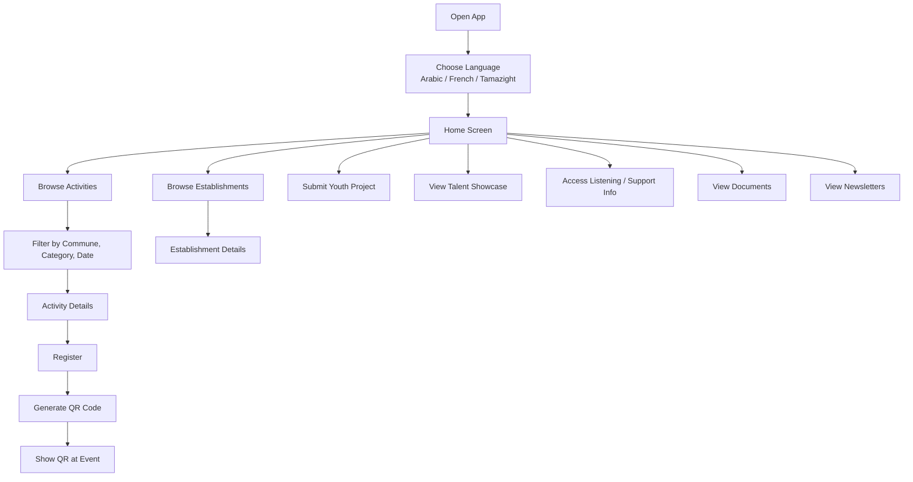

---

## 10.3 Activity Discovery

The activity discovery UI should use a simple card-deck experience inspired by Tinder-style browsing:

```txt
One activity card is visually dominant at a time.
Youth users can swipe or scroll through cards.
Users can skip, save, or open details from each card.
Filters remain available before and during card browsing.
The design must feel fast on older phones and weak networks.
```

Eco rule:

The card deck must be paginated and cache-friendly. It must not become an infinite social feed, must not preload full activity details, and must avoid heavy animations. Only the small card payload is loaded until the user opens the activity details page.

Users can filter activities by:

```txt
Commune
Wilaya
Category
Date
Establishment
Activity mode
Language
Age group
Free / paid
Registration availability
Accessibility
```

Activity modes:

```txt
physical
online
hybrid
```

Example activity card:

```json
{
  "id": "activity_123",
  "title": "Photography Workshop",
  "category": "Arts",
  "date": "2026-06-12",
  "commune": "Akbou",
  "activity_mode": "physical",
  "establishment_name": "Maison de Jeunes Akbou",
  "thumbnail": "photo-small.webp"
}
```

Eco rule:

The activity list and swipe-card deck return only small card data. Full details are loaded only when the user opens one activity.

---

## 10.4 Activity Details

Each activity page contains:

```txt
Title
Description
Category
Date and time
Activity mode: physical / online / hybrid
Location
Online link, optional
Establishment
Capacity
Available places
Registration deadline
Required documents
Languages
Accessibility notes
Contact phone
Contact email
Last verified date
```

Accuracy rule:

If data is missing, show:

```txt
Not specified by ODEJ.
```

The app must never invent missing details.

---

## 10.5 Establishment Directory

The directory contains ODEJ establishments such as:

```txt
Youth houses
Youth hostels
Sports complexes
Youth camps
Polyvalent halls
Scientific leisure centers
```

Each establishment contains:

```txt
Name
Type
Commune
Wilaya
Address
Phone
Email
Map location
Available services
Opening hours, if available
Accessibility notes
Current activities
Last verified date
```

---

## 10.6 Map View

The map helps users find establishments and opportunities.

Eco rules:

```txt
Do not load the map on the home screen.
Load the map only when the user opens the map page.
Request GPS only when the user clicks “near me.”
Do not track location continuously.
Cache establishment coordinates.
```

---

## 10.7 Registration and QR Code

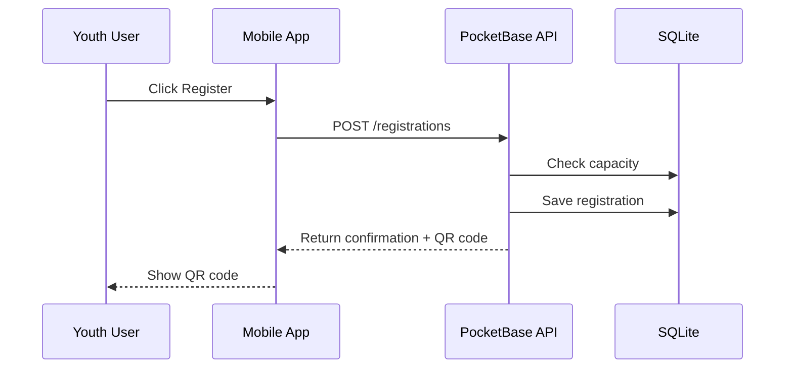

Registration status:

```txt
registered
waiting_list
cancelled
attended
```

QR code use:

```txt
The youth user shows the QR code at the activity.
ODEJ staff scans it.
The system marks attendance.
```

---

## 10.8 Low-Bandwidth Mode

Low-bandwidth mode supports youth in remote or isolated areas.

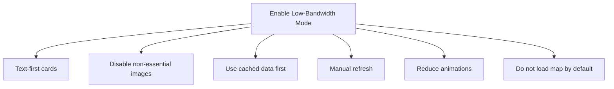

When enabled:

```txt
Images are not loaded automatically.
Activity cards become text-first.
Cached data is shown first.
Map is loaded only when opened.
Refresh is manual.
Animations are minimized.
```

Example message:

```txt
Showing cached activities.
Last updated: 02 June 2026, 14:30.
Tap to refresh.
```

---

# 11. ODEJ Admin Dashboard

## 11.1 Admin Roles

```txt
Super Admin
Wilaya Admin
Establishment Manager
Content Editor
Attendance Staff
```

---

## 11.2 Admin Features

Admin users can:

```txt
Manage establishments
Manage activities
Manage categories
Manage registrations
Scan QR attendance
Manage announcements
Manage newsletters
Manage documents
Manage translations
Review project submissions
Publish talent showcase items
Request admin-side event recommendation ideas
View simple analytics
Mark data as verified
Publish/unpublish content
```

---

## 11.3 Admin Publishing Flow

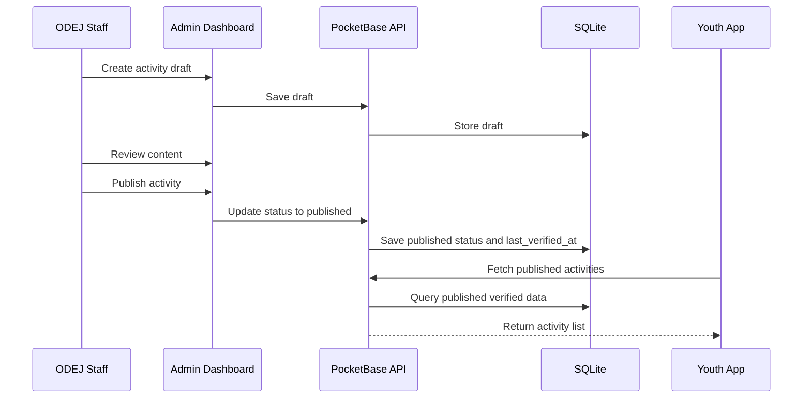

Only published and verified content appears in the youth app.

---

# 12. Added Engagement Modules

## 12.1 Hybrid Activities

Activities can be:

```txt
physical
online
hybrid
```

Fields:

```txt
activity_mode
online_link
bandwidth_level
replay_available
```

Eco rule:

The app does not host heavy video content.
If an activity is online, the app stores only the verified external link.

---

## 12.2 Remote Participation

For isolated youth, the app supports:

```txt
Low-bandwidth mode
Cached establishment directory
Online/hybrid activity links
Text-first activity cards
Manual refresh
Compressed images
```

Goal:

Youth from remote communes can discover and join opportunities without needing strong internet or a powerful phone.

---

## 12.3 Youth Project Incubation

Young people can submit project ideas to ODEJ.

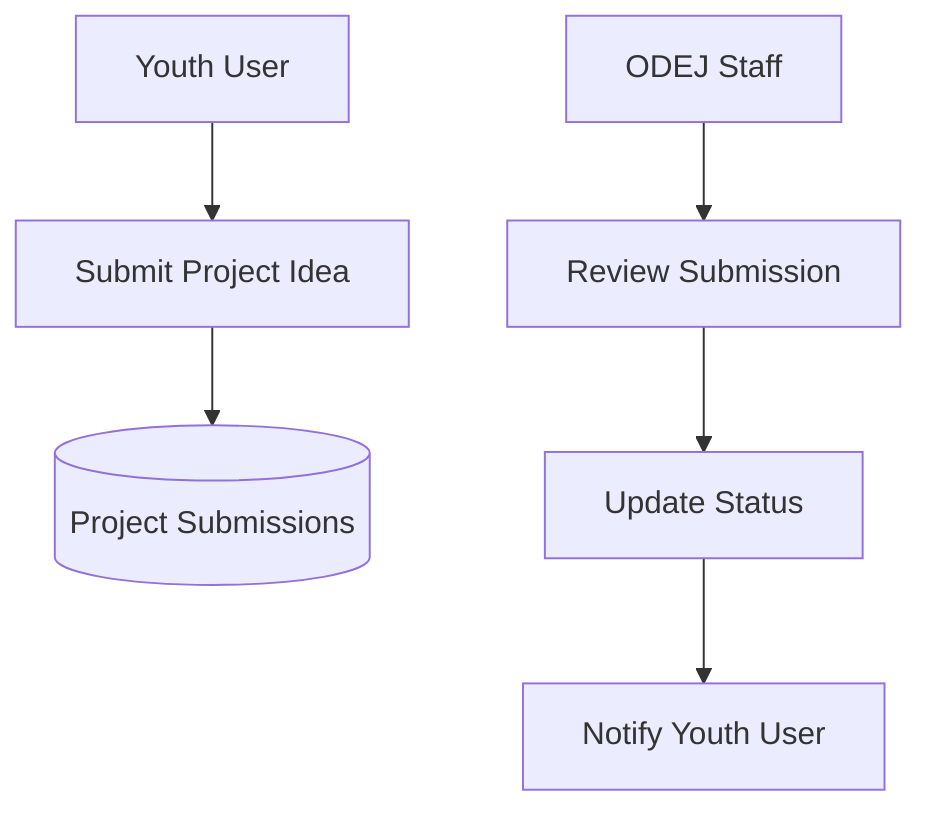

Project submission fields:

```txt
Project title
Category
Commune
Short description
Needed support
Contact phone
Optional document
Preferred establishment
Status
Assigned mentor, optional
```

Project status:

```txt
submitted
reviewed
accepted
rejected
needs_more_info
```

Eco rule:

The project form is text-first. Large media uploads are not required.

---

## 12.4 Lightweight Talent Showcase

ODEJ staff can publish selected youth achievements.

Examples:

```txt
Competition winners
Art projects
Volunteer initiatives
Coding projects
Photography
Short films, link only
Local success stories
```

Eco-friendly restrictions:

```txt
No public social feed
No public comments
No likes system
No infinite scrolling
No video hosting
No large galleries
Admin-curated only
Paginated list
Compressed images
```

---

## 12.5 Restrained Notifications

Notifications are simple and limited.

Allowed:

```txt
Weekly digest
Daily digest, optional
Registration confirmation
Activity reminder
Activity cancellation
New activity matching selected interests
Admin-published newsletter digest
```

Avoid:

```txt
Real-time social notifications
Like/comment notifications
Continuous promotional push
Spam notifications
```

Notification logic:

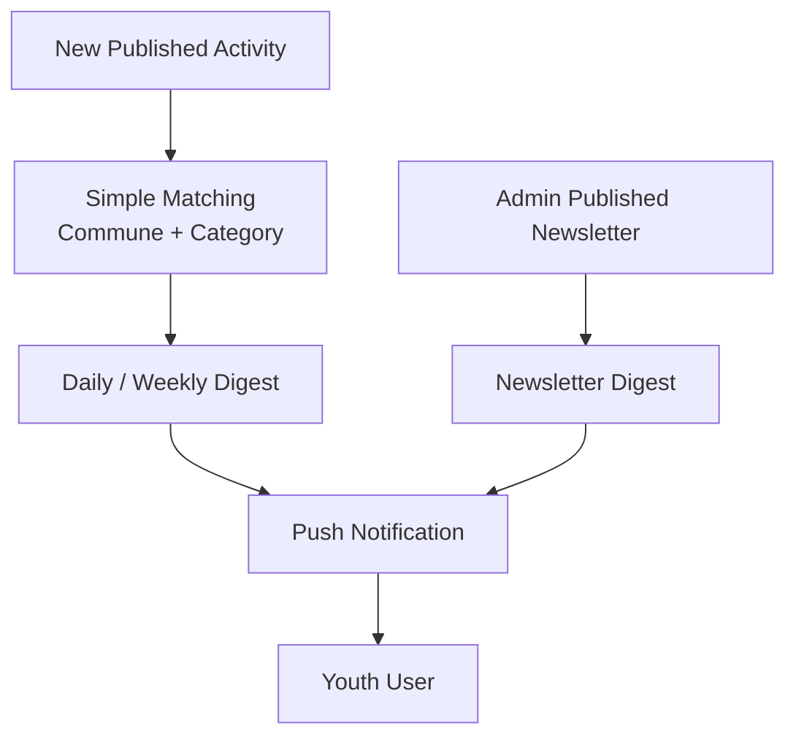

---

## 12.6 Admin Event Recommendation Helper

Admins may request lightweight recommendations for new event ideas.

Purpose:

```txt
Help ODEJ staff discover possible activity themes.
Suggest event ideas based on existing verified categories, commune needs, season, and available establishments.
Support admins when planning new youth opportunities.
Keep the final publishing decision fully human.
```

Implementation rule:

The team should research eco-friendly AI models and API providers before implementation. The selected provider must support low-token, on-demand admin requests and must not require a separate always-running AI service.

Allowed recommendation inputs:

```txt
Existing verified activity categories
Commune or wilaya
Establishment type
Season or date range
Available capacity
Youth interests, aggregated only
Previously popular categories, aggregate only
```

Recommendation output:

```txt
Suggested activity title
Short rationale for admin review
Suggested category
Suggested target age group
Suggested format: physical / online / hybrid
Required resources, if known
```

Eco-friendly restrictions:

```txt
Manual admin request only
No recommendations during normal youth browsing
No per-user profiling
No continuous background jobs
No heavy recommendation engine
No automatic publishing
Cache repeated recommendation requests when inputs are the same
Limit prompt and response size
```

Accuracy rule:

Recommendations are planning suggestions only. They must never invent real scheduled activities, places, phone numbers, or availability. Admins must convert any accepted suggestion into a normal activity draft and verify it before publishing.

---

## 12.7 Admin Newsletters

ODEJ admins can publish simple newsletters for youth users.

Newsletter examples:

```txt
Weekly opportunities digest
Upcoming registration deadlines
New youth programs
Volunteer calls
Orientation and prevention messages
Important ODEJ updates
```

Newsletter publishing flow:

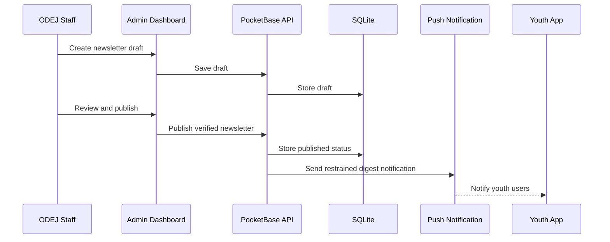

Eco-friendly restrictions:

```txt
Plain text first
No heavy images required
No video attachments
Compressed thumbnail optional
Digest notification instead of repeated push spam
Respect language and commune preferences
Allow users to disable newsletter notifications
```

---

## 12.8 Simple Admin Analytics

Analytics are based on simple database queries.

Metrics:

```txt
Number of published activities
Number of registrations
Attendance rate
Activities by commune
Activities by category
Most active establishments
Most requested categories
Outdated information count
Project submissions count
```

Avoid:

```txt
Realtime dashboards
User behavior tracking
Complex data pipelines
AI analytics
Profiling users
```

---

# 13. Caching Strategy

The final design uses caching without Redis.

The strategy is:

```txt
Cache at the edge first.
```

This means the app caches public data on the user device first, then validates freshness using HTTP caching.

---

## 13.1 Caching Layers

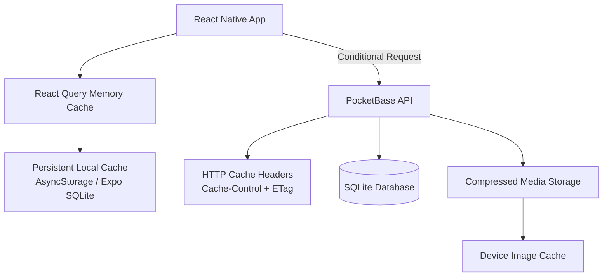

---

## 13.2 Cache Locations

### 1. React Query Memory Cache

Used for:

```txt
Current activity list
Activity details
Establishment list
Announcements
Categories
User registration state
```

Purpose:

```txt
Avoid repeated API calls while the app is open.
```

---

### 2. Persistent Mobile Cache

Used for:

```txt
Establishments
Categories
Communes
Last loaded activities
Selected language
User preferences
Low-bandwidth setting
```

Storage:

```txt
AsyncStorage for key-value data
Expo SQLite for structured offline data
```

Purpose:

```txt
Reduce mobile data usage.
Improve weak-network access.
Reduce battery usage.
```

---

### 3. HTTP Cache

Used for:

```txt
Public activities
Establishments
Categories
Announcements
Newsletters
Documents
Images
```

Example:

```http
Cache-Control: public, max-age=3600
ETag: "activities-v42"
```

If data has not changed, the server can return:

```http
304 Not Modified
```

instead of resending the full response.

---

### 4. Media Cache

Used for:

```txt
Activity thumbnails
Establishment images
Document previews
```

Rules:

```txt
Use WebP thumbnails.
Compress uploaded images.
Lazy-load images.
Avoid large galleries.
Avoid video hosting.
```

---

### 5. Database Optimization

Used for:

```txt
Fast filtering
Fast search
Small responses
```

Indexes:

```txt
activity.status
activity.start_datetime
activity.commune
activity.category_id
activity.establishment_id
establishment.commune
establishment.type
registration.activity_id
registration.user_id
```

---

## 13.3 Cache Duration Table

| Data Type          | Cache Location                 |                      Duration | Reason               |
| ------------------ | ------------------------------ | ----------------------------: | -------------------- |
| Categories         | Mobile + HTTP cache            |                        7 days | Rarely changes       |
| Establishments     | Mobile + HTTP cache            |                      24 hours | Changes slowly       |
| Activity list      | React Query + persistent cache |                 30–60 minutes | Changes moderately   |
| Activity details   | React Query cache              |                    30 minutes | Can be edited        |
| Announcements      | React Query + HTTP cache       |                 10–30 minutes | Can be urgent        |
| Newsletters        | React Query + HTTP cache       |                 10–30 minutes | Can be urgent        |
| Documents          | HTTP + device cache            |                        7 days | Usually stable       |
| Images             | Device image cache             | Long cache with versioned URL | Media rarely changes |
| User registrations | Short session cache only       |                         Short | User-specific        |

---

## 13.4 Why No Redis in MVP?

Redis is not used because the MVP does not need a separate in-memory cache.

Instead, we use:

```txt
React Query cache
Persistent mobile cache
HTTP cache headers
Indexed SQLite queries
Pagination
Compressed media
Small API responses
```

This avoids:

```txt
Extra server memory usage
Extra infrastructure
Extra deployment complexity
Extra failure points
Extra monitoring
```

Redis can be added later only if the platform grows and repeated expensive queries become a real issue.

---

# 14. API Design

The API separates list responses from detail responses.

This reduces payload size because users do not download full details for items they never open.

---

## 14.1 Activity List

```http
GET /api/activities?page=1&limit=10&commune=Akbou&category=sports
```

Returns small card data:

```json
{
  "items": [
    {
      "id": "activity_123",
      "title": "Football Tournament",
      "category": "Sports",
      "date": "2026-06-12",
      "commune": "Akbou",
      "activity_mode": "physical",
      "establishment_name": "Maison de Jeunes Akbou",
      "thumbnail": "football-small.webp"
    }
  ],
  "page": 1,
  "hasMore": true
}
```

---

## 14.2 Activity Details

```http
GET /api/activities/activity_123
```

Returns:

```json
{
  "id": "activity_123",
  "title": "Football Tournament",
  "description": "...",
  "category": "Sports",
  "activity_mode": "physical",
  "start_datetime": "2026-06-12T09:00:00",
  "end_datetime": "2026-06-12T12:00:00",
  "establishment": {
    "name": "Maison de Jeunes Akbou",
    "address": "...",
    "phone": "..."
  },
  "capacity": 40,
  "available_places": 12,
  "last_verified_at": "2026-06-01T10:00:00Z"
}
```

---

## 14.3 Establishments

```http
GET /api/establishments?commune=Akbou&type=youth_house&page=1&limit=10
```

---

## 14.4 Registration

```http
POST /api/registrations
```

Body:

```json
{
  "activity_id": "activity_123",
  "full_name": "User Name",
  "phone": "0550000000",
  "email": "optional@email.com"
}
```

---

## 14.5 Project Submission

```http
POST /api/project-submissions
```

Body:

```json
{
  "project_title": "Local Robotics Club",
  "category": "Science",
  "commune": "Akbou",
  "short_description": "A youth-led robotics club for beginners.",
  "needed_support": "Mentor and room",
  "contact_phone": "0550000000"
}
```

---

## 14.6 Announcements

```http
GET /api/announcements?page=1&limit=10
```

---

## 14.7 Newsletters

```http
GET /api/newsletters?page=1&limit=10&language=fr&commune=Akbou
```

Admin publish:

```http
POST /api/newsletters
```

Body:

```json
{
  "title": "Weekly Youth Opportunities",
  "content": "A short text-first digest of verified ODEJ updates.",
  "language": "fr",
  "target_commune": "Akbou",
  "status": "draft"
}
```

---

## 14.8 Admin Event Recommendation Request

```http
POST /api/admin/event-recommendations
```

Body:

```json
{
  "commune": "Akbou",
  "establishment_type": "youth_house",
  "season": "summer",
  "available_categories": ["Sports", "Environment", "Science"],
  "capacity_range": "20-40"
}
```

Returns draft suggestions for admin review only:

```json
{
  "items": [
    {
      "suggested_title": "Eco Photography Walk",
      "category": "Environment",
      "rationale": "Combines youth creativity with local environmental awareness.",
      "activity_mode": "physical",
      "target_age_group": "15-24"
    }
  ],
  "status": "draft_suggestions_only"
}
```

Eco rule:

This endpoint is admin-only, manual, rate-limited, and optional. It must call a selected eco-friendly model API only when an admin requests suggestions.

---

## 14.9 Documents

```http
GET /api/documents?category=orientation&language=fr&page=1&limit=10
```

---

# 15. Database / Collection Design

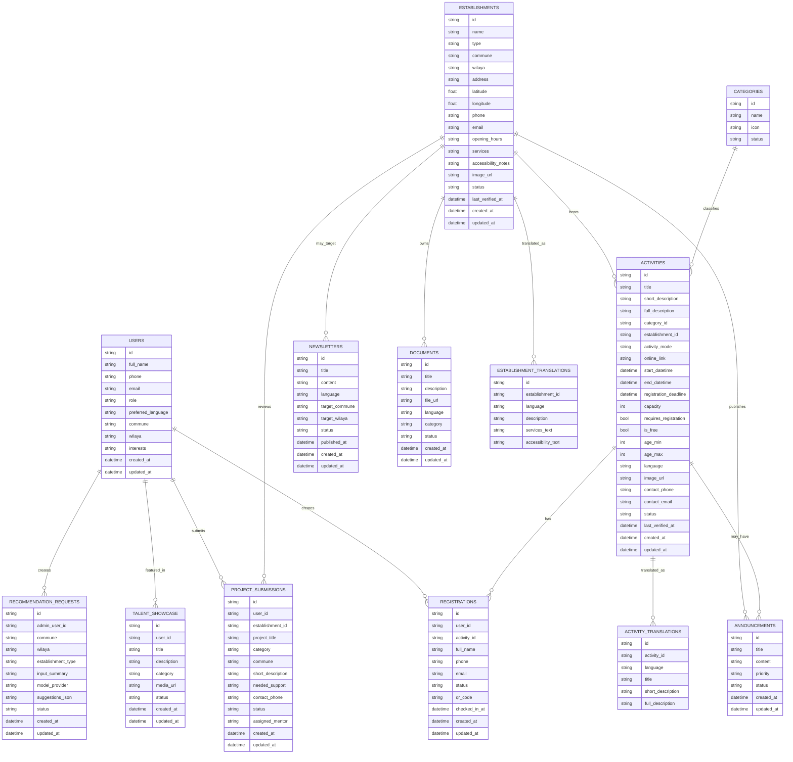

---

# 16. Suggested PocketBase Collections

## 16.1 users

Purpose:

```txt
Store youth users and admin users.
```

Fields:

```txt
full_name
email
phone
role
preferred_language
commune
wilaya
interests
created_at
updated_at
```

Roles:

```txt
youth
super_admin
wilaya_admin
establishment_manager
content_editor
attendance_staff
```

---

## 16.2 establishments

Purpose:

```txt
Store ODEJ establishments.
```

Fields:

```txt
name
type
commune
wilaya
address
latitude
longitude
phone
email
opening_hours
services
accessibility_notes
image
status
last_verified_at
```

Types:

```txt
youth_house
youth_hostel
sports_complex
youth_camp
polyvalent_hall
scientific_leisure_center
```

---

## 16.3 activities

Purpose:

```txt
Store activities and opportunities.
```

Fields:

```txt
title
short_description
full_description
category
establishment
activity_mode
online_link
start_datetime
end_datetime
registration_deadline
capacity
requires_registration
is_free
age_min
age_max
language
image
contact_phone
contact_email
status
last_verified_at
```

Status:

```txt
draft
published
cancelled
archived
```

---

## 16.4 registrations

Purpose:

```txt
Store activity registrations and attendance.
```

Fields:

```txt
user
activity
full_name
phone
email
status
qr_code
checked_in_at
```

Status:

```txt
registered
waiting_list
cancelled
attended
```

---

## 16.5 categories

Purpose:

```txt
Store activity categories.
```

Examples:

```txt
Sports
Culture
Training
Volunteering
Health Awareness
Science
Arts
Environment
Youth Orientation
Camps and Trips
Coding
Design
Robotics
Photography
Debate
```

---

## 16.6 announcements

Purpose:

```txt
Store public announcements.
```

Fields:

```txt
title
content
priority
related_establishment
related_activity
language
status
```

---

## 16.7 newsletters

Purpose:

```txt
Store admin-published newsletters and youth digests.
```

Fields:

```txt
title
content
language
target_commune
target_wilaya
related_activity
related_establishment
thumbnail, optional
status
published_at
```

Eco rule:

Newsletters are text-first. Images are optional, compressed, and not required for the message to be understood.

---

## 16.8 documents

Purpose:

```txt
Store guides, PDFs, and orientation documents.
```

Fields:

```txt
title
description
file
language
category
establishment
status
```

---

## 16.9 project_submissions

Purpose:

```txt
Allow youth to submit project ideas.
```

Fields:

```txt
user
establishment
project_title
category
commune
short_description
needed_support
contact_phone
optional_document
status
assigned_mentor
```

---

## 16.10 talent_showcase

Purpose:

```txt
Publish selected youth achievements.
```

Fields:

```txt
user
title
description
category
media
external_link
status
published_at
```

---

## 16.11 recommendation_requests

Purpose:

```txt
Store admin-side event recommendation requests and draft suggestions.
```

Fields:

```txt
admin_user
commune
wilaya
establishment_type
input_summary
model_provider
model_api_used
suggestions_json
status
created_at
```

Eco rule:

Store only the compact request summary and returned suggestions. Do not store unnecessary prompts, personal youth profiles, or large model traces.

---

## 16.12 translations

Possible approach:

Create separate collections:

```txt
activity_translations
establishment_translations
category_translations
```

Supported languages:

```txt
ar
fr
tzm
```

---

# 17. Optional AI Design

AI is optional and admin-side only.

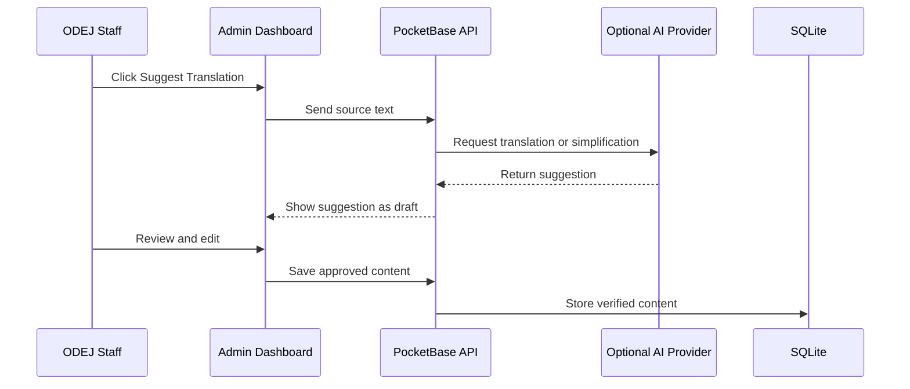

Allowed AI uses:

```txt
Translation suggestion
Text simplification
Duplicate activity detection
Admin-side event idea recommendations
```

Forbidden AI uses:

```txt
Inventing activities
Inventing establishment services
Guessing phone numbers
Guessing schedules
Medical or psychological advice
Always-on chatbot
Heavy recommendation engine
AI for every user search
Automatic event publishing
```

AI rules:

```txt
Manual only
Cached
Rate-limited
Staff-reviewed
Never published automatically
Optional for MVP
Eco-friendly model/API must be researched before implementation
Selected model/API must support small on-demand admin requests
```

---

# 18. Data Accuracy Design

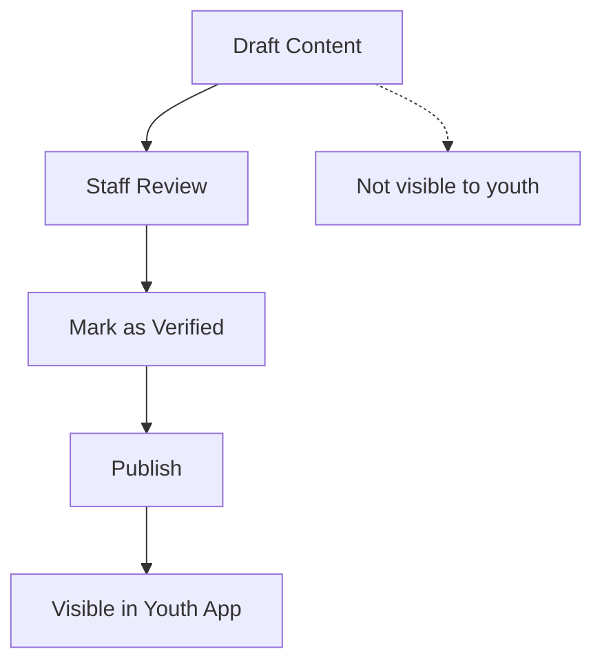

Rules:

```txt
Only published content is visible.
Every public item has last_verified_at.
Missing information is shown as “Not specified by ODEJ.”
AI-generated text is draft-only until reviewed.
Users can report outdated information.
Admins can archive old content.
Admin newsletters are draft-only until reviewed and published.
Admin recommendation suggestions are draft-only and must be converted into verified activity drafts before publication.
```

This prevents hallucinated or unverified information.

---

# 19. Security Requirements

The platform must include:

```txt
HTTPS only
Admin authentication
Role-based access rules
Input validation
File upload validation
Image size limits
Private admin collections
Public read-only access for published content
Audit fields: created_by, updated_by
No public access to drafts
No public access to admin data
```

File upload limits:

```txt
Activity image: max 300 KB after compression
Establishment image: max 300 KB after compression
Documents: PDF only, size-limited
Video uploads: not allowed in MVP
```

---

# 20. Accessibility Requirements

The platform must support:

```txt
Arabic
French
Tamazight
Clear typography
High contrast mode
Dark mode
Large touch targets
Screen-reader friendly labels
Simple navigation
Low-bandwidth mode
No important information hidden inside images
```

---

# 21. Eco-Friendly Requirements

## 21.1 Frontend Eco Rules

The mobile app must:

```txt
Use dark mode by default.
Use compressed images.
Lazy-load images.
Avoid autoplay video.
Avoid heavy animations.
Avoid unnecessary background services.
Avoid continuous GPS tracking.
Use local caching.
Use pagination.
Load details only on demand.
Provide low-bandwidth mode.
Keep swipe-card discovery lightweight and paginated.
```

---

## 21.2 Backend Eco Rules

The backend must:

```txt
Use one lightweight backend service.
Use SQLite.
Use indexed queries.
Return only needed fields.
Use pagination.
Use HTTP caching.
Avoid Redis in MVP.
Avoid microservices.
Avoid heavy background jobs.
Avoid AI in normal browsing.
Use model APIs only for manual admin requests.
Avoid realtime systems unless required.
```

---

## 21.3 Data Eco Rules

The data layer must:

```txt
Separate list data from detail data.
Avoid large JSON payloads.
Compress uploaded images.
Store only necessary media.
Avoid video hosting.
Cache stable data.
Use last_verified_at for reliability.
Archive outdated content.
Store newsletter content as text-first data.
Store recommendation requests as compact summaries only.
```

---

# 22. ECOHACK Evaluation Mapping

## 22.1 Eco-Efficiency — 30%

The project supports this criterion through:

```txt
Lightweight PocketBase backend
SQLite database
No Redis in MVP
No microservices
Mobile caching
HTTP caching
Small payloads
Compressed images
Dark mode
Low-bandwidth mode
No autoplay video
No continuous GPS
Manual AI only
Manual admin-only recommendation requests
Text-first newsletters
```

---

## 22.2 Accuracy and Reliability — 30%

The project supports this criterion through:

```txt
Admin-verified content
Published/draft workflow
last_verified_at field
No hallucinated information
Missing information clearly marked
AI suggestions reviewed before publishing
Recommendation suggestions reviewed before becoming activity drafts
Newsletters reviewed before publishing
Report outdated information feature
```

---

## 22.3 UX and Accessibility — 20%

The project supports this criterion through:

```txt
Mobile-first app
Simple navigation
Search and filters
Swipe-card activity discovery
Arabic/French/Tamazight support
Dark mode
Low-bandwidth mode
Large touch targets
Text-first cards
Cached access on weak networks
```

---

## 22.4 Maintainability — 20%

The project supports this criterion through:

```txt
PocketBase admin dashboard
No-code content updates
Simple collections
Role-based access
Minimal infrastructure
Clear publishing workflow
Easy backups
Simple deployment
```

---

# 23. MVP Scope

## 23.1 Must-Have Features

For the hackathon MVP, build:

### Youth App

```txt
Language selection
Home screen
Activity list
Swipe-card activity discovery
Activity details
Establishment directory
Establishment details
Search and filters
Registration form
QR code display
Announcements
Newsletter inbox
Low-bandwidth mode
Local caching
```

### Admin Dashboard

```txt
Admin login
Manage establishments
Manage activities
Manage categories
Manage registrations
Publish newsletters
Publish/unpublish content
Update multilingual fields
Upload compressed images
View simple statistics
```

### Backend

```txt
PocketBase setup
SQLite collections
Auth rules
Public read rules for published content
Admin write rules
File storage
Basic validation rules
```

---

## 23.2 Should-Have Features

Add if time allows:

```txt
QR attendance scanning
Project submissions
Talent showcase
Document library
Interest-based notifications
Report outdated information
CSV export
```

---

## 23.3 Could-Have Features

Add only if the MVP is complete:

```txt
AI translation assistant
AI text simplification
Duplicate detection
Eco-friendly model/API research for admin event recommendations
Admin-side event recommendation helper
Offline attendance sync
Advanced map filters
More analytics
```

---

## 23.4 Out of Scope

Do not build:

```txt
Full social network
Public comments
Likes system
Video feed
Reels
Video hosting
Complex AI chatbot
Microservices
Redis
Kafka
Blockchain
Heavy recommendation engine
Continuous GPS tracking
Realtime global dashboards
```

---

# 24. User Journey

## 24.1 Youth Journey

```txt
1. User opens the app.
2. User chooses language.
3. App loads cached categories and establishments.
4. User selects commune and interests.
5. User sees upcoming verified opportunities.
6. User swipes or scrolls through activity cards.
7. User filters by category, date, or location.
8. User opens activity details.
9. User registers.
10. App generates QR code.
11. User attends activity and shows QR code.
12. Staff scans QR code and marks attendance.
13. User receives restrained newsletter or digest notifications when enabled.
```

---

## 24.2 ODEJ Staff Journey

```txt
1. Staff logs into the dashboard.
2. Staff creates an activity draft.
3. Staff fills title, description, date, place, capacity.
4. Staff adds multilingual fields.
5. Optional AI suggests translation.
6. Staff optionally requests event recommendation ideas using a selected eco-friendly model API.
7. Staff reviews content.
8. Staff publishes activity.
9. Staff publishes a newsletter or digest when needed.
10. Youth users see it in the app and receive restrained notifications if enabled.
11. Staff manages registrations.
12. Staff scans QR codes for attendance.
13. Staff archives activity after completion.
```

---

# 25. Final Architecture Decision

```txt
Mobile App:
React Native + Expo + TypeScript

Backend:
PocketBase

Database:
SQLite

Admin Dashboard:
PocketBase Admin UI

Caching:
React Query memory cache
AsyncStorage / Expo SQLite persistent cache
HTTP Cache-Control + ETag
Device image cache
Indexed SQLite queries
Pagination

AI:
Optional admin-side helper only
Manual eco-friendly model/API for admin event recommendations

Notifications:
Digest, reminders, and admin newsletters only

Media:
Compressed images, no video hosting

Deployment:
Small VPS + Caddy/Nginx + HTTPS + scheduled backups
```

---

# 26. One-Sentence Product Pitch

Chabab Connect is a lightweight multilingual mobile platform that helps Algerian youth discover verified ODEJ activities, spaces, and services while allowing ODEJ staff to update information easily through a no-code dashboard.

---

# 27. One-Sentence Technical Pitch

The platform uses a lightweight React Native mobile app connected to a single PocketBase backend with SQLite, mobile-first caching, HTTP cache validation, compressed media, and optional admin-side AI only, allowing ODEJ staff to publish verified youth opportunities without code while minimizing bandwidth, battery usage, server compute, and infrastructure complexity.

```
```
